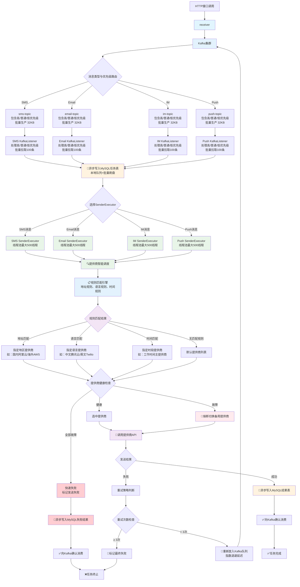
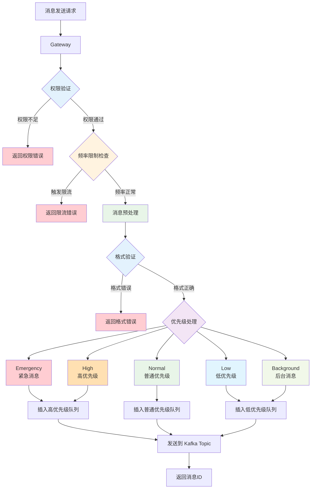
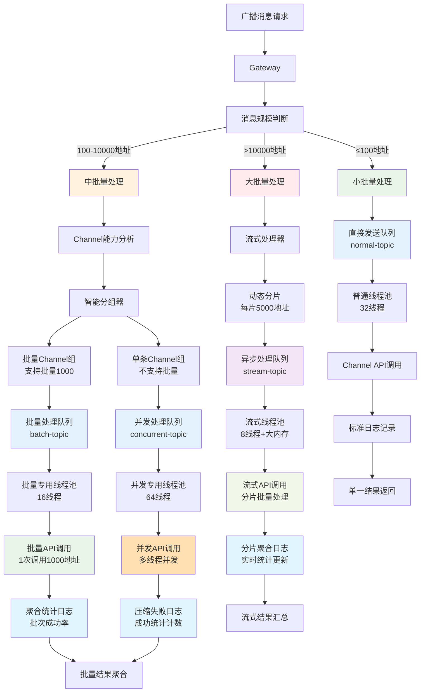



# Ass Kicker

统一通知中心平台，旨在集成和管理多种通知渠道类型 [SMS](#SMS) / [Email](#Email) / [IM](#IM) / [Push](#Push) 的多个供应商实现。主要功能包括：

- 支持同一渠道类型的多个供应商接入（如同时集成阿里云、腾讯云等短信提供商）
- 智能路由选择最优供应商发送
- 统一的消息模板、优先级和状态管理
- 跨渠道的消息撤回和回执功能
- 供应商级的限流和故障转移机制

通过标准化接口简化业务系统与各类通知服务的集成，提高消息送达率和系统可靠性。

## 整体架构

- **Controller**: 接收发送任务，管理调度 Worker
  - **Client Authorization**: 验证发送方身份，避免被攻击
  - **Rate Limiter**: 频率限制，避免费用异常消耗
  - **Connection Pool**: 用户设备、通道连接池，避免重复通知
  - **User Pool**: 用户池，分组广播
- **Worker**: 执行发送任务，保存消息日志
  - **Template**: 消息模板，相同业务含义不同语言的模板，使用相同的模板 code 和对应语言的语言 code
  - **Channel**： 同一个提供商下的不同账号初始化的发送连接就是不同的 channel
  - **Message**: 需要发送的消息，包含发送方、接收方信息，消息内容（如果使用模板就是模板 id 和参数列表）
  - **Channel Scheduler**: 调度 channel 实现路由、熔断等功能

## Controller

Gateway 负责接收发送消息请求，包含以下核心功能：

- 权限验证：判断发送方是否具有使用指定模板或指定 channel 的权限
- 频率限制：基于发送方、接收方、消息类型等多维度限流
- 优先级处理：根据消息优先级调整处理顺序
- 消息预处理：验证消息格式、参数完整性等

### 优先级

消息优先级分为 5 个等级，从高到低依次为：

| 优先级 | 名称       | 描述                                                       |
| ------ | ---------- | ---------------------------------------------------------- |
| 0      | Emergency  | 最高优先级，如系统故障、安全警报等，会触发所有可用通知渠道 |
| 1      | High       | 重要通知，如账户安全变更、支付确认等                       |
| 2      | Normal     | 常规通知，默认优先级                                       |
| 3      | Low        | 低优先级通知，如营销信息、系统公告等                       |
| 4      | Background | 最低优先级，仅在用户主动查看时显示，不会主动推送           |

优先级会影响：

- 消息发送的渠道选择
- 重试策略
- 通知的展示方式(如紧急通知会持续提醒直到确认)

### 通知范围

#### 单播

#### 多播

#### 广播

#### 广播分层处理架构

广播消息由于涉及大量地址，需要采用分层处理策略来优化性能和资源利用。系统根据消息规模、Channel 能力和业务优先级进行智能分层处理。

**分层策略说明：**

1. **小批量广播（≤100 地址）**：直接处理，使用普通处理队列
2. **中批量广播（100-10000 地址）**：按 Channel 能力分批处理
3. **大批量广播（>10000 地址）**：异步流式处理，专用资源池

**核心优化原则：**

- 避免消息爆炸：不将广播拆分成大量单播
- Channel 适配：根据批量能力智能分组
- 资源隔离：不同规模使用独立处理资源
- 日志优化：采用聚合统计减少存储压力

**分层处理详细说明：**

**1. 小批量广播处理（≤100 地址）**

- 直接使用普通处理队列，无需特殊优化
- 适用于部门通知、小组消息等场景
- 处理延迟：< 5 秒

**2. 中批量广播处理（100-10000 地址）**

- 根据 Channel 能力进行智能分组
- 支持批量的 Channel：按最大批量能力分批（如 1000 个/批）
- 不支持批量的 Channel：使用多线程并发处理
- 适用于全员通知、营销推广等场景
- 处理延迟：< 30 秒

**3. 大批量广播处理（>10000 地址）**

- 采用流式处理，动态分片
- 每片 5000 地址，避免内存压力
- 异步处理，不阻塞其他消息
- 适用于系统公告、重大事件通知等场景
- 处理延迟：< 2 分钟

**日志记录优化：**

- 小批量：标准单条日志记录
- 中批量：按批次记录成功率，仅详记失败地址
- 大批量：分片聚合统计，实时更新进度

**资源隔离保证：**

- 不同规模使用独立的 Kafka Topic 和线程池
- 防止大批量消息影响小批量消息的实时性
- 各层级可独立扩容和优化

#### 任播

## Worker

### Template

发送消息的模板，方便管理消息内容，减少发送消息请求的数据量

消息可以没有模板，由发送方直接填写消息内容，也可以通过模板组装完整的消息。
模板需支持多语言内容与参数化填充，便于统一管理和复用。

### Channel

通道定义：一个 Channel 的一个账号（Account）或身份（Identity）就是一个通道。
通道需要具备供应商信息、鉴权方式、调用路径、回执检查与地址绑定规则等业务能力配置。

目的地绑定

| 编号 | 规则       | 处理的地址             |
| :--: | :--------- | ---------------------- |
|  1   | ANY        | 任意地址               |
|  2   | EQUALS     | 满足正则表达式的地址   |
|  3   | NOT_EQUALS | 不满足正则表达式的地址 |

通道使用正则表达式绑定消息地址，当通道 X 配置了地址表达式之后，所有满足的地址将只使用 X 通道发送。

### Channel Scheduler

- 轮询
- 加权轮询

### Message

**站内信（On-Site Messages）** 是大部分推送消息的来源，通过 [SMS](#SMS) / [Email](#Email) / [IM](#IM) 等站外渠道发送的消息，通常情况下无需在站内信中再次展示

消息需要支持模板或直发两种模式、优先级、回执、撤回、过期与状态追踪等业务能力。

### 短信服务

短信或语音电话

Short Messaging Service 协议规定单条短信内容最大长度 **140 byte** ，使用 GSM 7 位编码一个汉字占 2 byte，也就是最多 70 个汉字。

电话号码没有识别性，为了表明发送者身份短信开头必须使用 **【签名】** 表明身份。

签名（Sign)

为了方便用户识别消息来源，纯文字内容的消息都会有签名（Sign）。按提供商管理

短信请求需要支持模板参数、批量目的地和多语言投递。

### 电子邮件

电子邮件，通常需要主题和附件，内容格式多为 HTML 内容，除此之外邮件没有其他限制。

邮件请求需支持主题、附件、HTML 内容与多语言目的地。

### 即时通讯

即时通讯没有统一的协议，只能针对各家平台单独对接。

有的平台是提供一个叫做 bot 的子账号用于自动发布消息，bot 的作用范围一般分为全平台通用或者会话专用。所以我们需要一个自定义协议作中间协议用来对接到不同提供商的私有协议。

即时通讯需要支持多平台地址映射与转发策略，统一对接各自私有协议。

### 推送服务

应用（APP）一般分为桌面端 / 移动端 / Web 端，推送（Push）一般分为系统推送和应用推送，每个平台都有各自平台级的推送服务，如下：

| Platform    | Platform Notification Service                                                                                                                              |
| ----------- | ---------------------------------------------------------------------------------------------------------------------------------------------------------- |
| Windows     | [WNS](https://learn.microsoft.com/zh-cn/windows/apps/design/shell/tiles-and-notifications/windows-push-notification-services--wns--overview)               |
| macOS / iOS | [APNs](https://developer.apple.com/notifications/)                                                                                                         |
| Android     | [GCM](https://firebase.google.com/docs/cloud-messaging)                                                                                                    |
| Browser     | [Push API](https://developer.mozilla.org/en-US/docs/Web/API/Push_API) / [Web Push Protocol](https://web.dev/articles/push-notifications-web-push-protocol) |

[Push](#Push) 只能通知 APP 已有功能的信息，[SMS](#SMS) / [EMAIL](#Email) / [IM](#IM) 除了可以通知 APP 内的信息，也可以通知其他信息，此外还可以作为用户身份的凭证。

#### 个推

推送需要支持请求幂等、离线时长、受众选择与通知内容配置。

推送 notification 通知行为和模板配置在一起。

具体的通知的响铃形式由模板管理。
