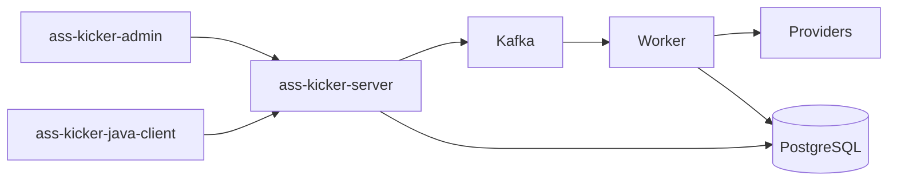
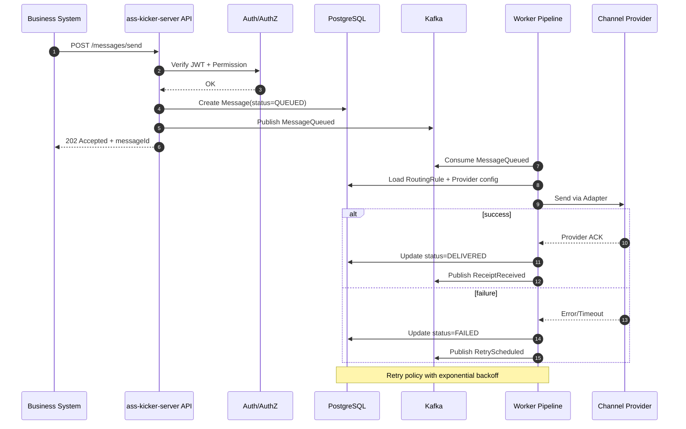
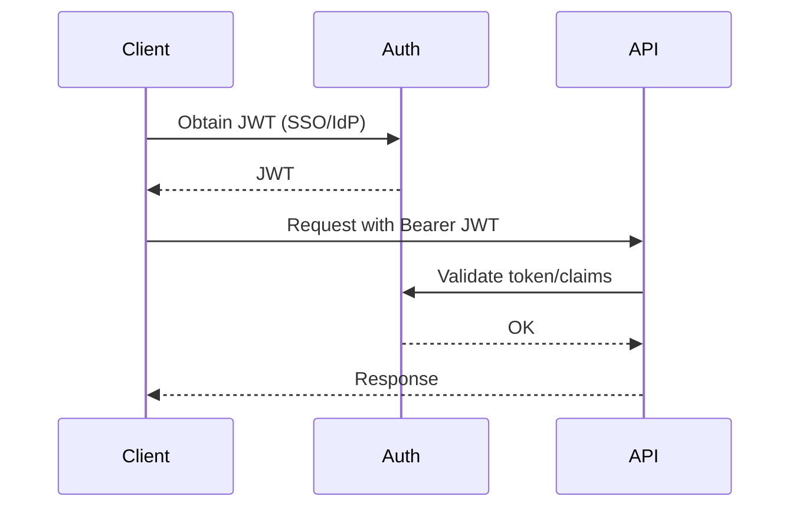
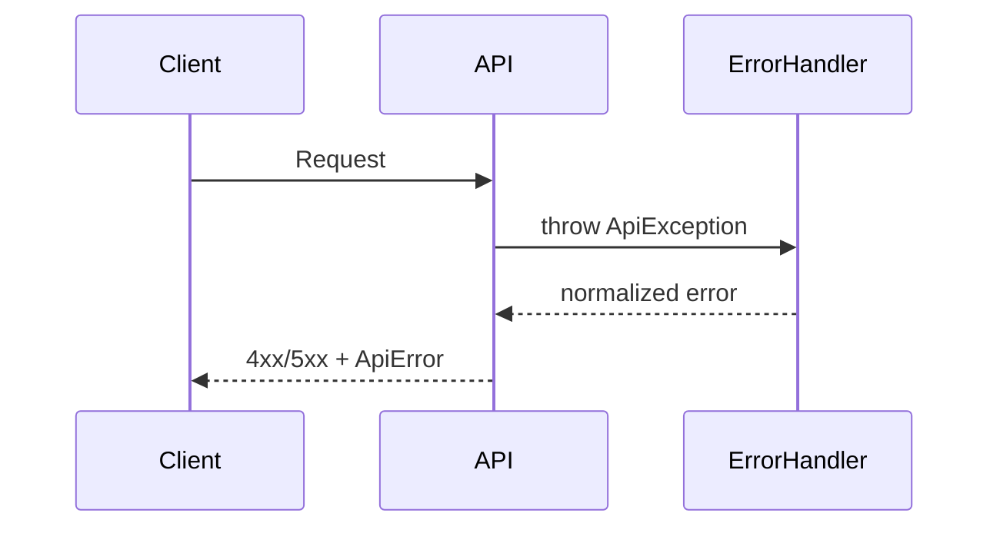

# Ass Kicker Fullstack Architecture Document

## Introduction

This document outlines the complete fullstack architecture for Ass Kicker, including backend systems, frontend implementation, and their integration. It serves as the single source of truth for AI-driven development, ensuring consistency across the entire technology stack.

This unified approach combines what would traditionally be separate backend and frontend architecture documents, streamlining the development process for modern fullstack applications where these concerns are increasingly intertwined.

### Starter Template or Existing Project

N/A - Greenfield project.

### Change Log

| Date       | Version | Description                          | Author              |
| ---------- | ------- | ------------------------------------ | ------------------- |
| 2026-01-26 | v0.1    | Initial fullstack architecture draft | Winston (Architect) |
| 2026-01-26 | v0.2    | Record architecture decisions        | Codex               |

## High Level Architecture

### Technical Summary

Ass Kicker 采用模块化单体 + 事件驱动异步管线的架构，核心 API 使用 Spring Boot 3 + WebFlux，前端管理台为 Vue 3 + Ant Design Vue。业务系统与控制台统一通过 API 进入鉴权与校验后写入 Kafka 主题，异步 Worker 负责路由选择、投递、重试与回执处理。核心配置与投递数据存储在 PostgreSQL，热点规则与限流策略采用 Caffeine 本地缓存以降低延迟。系统按 API 层与 Worker 层分别水平扩展，并以 ELK + Prometheus/Grafana + Trace 覆盖全链路可观测性。该架构满足高吞吐、故障转移与多渠道扩展的目标，并支持后续从单体逐步拆分。

### Platform and Infrastructure Choice

**选项 A：私有云/企业内 Kubernetes + 自建 Kafka + PostgreSQL**

- 优点：满足企业安全与合规，数据可控，网络延迟可预测
- 缺点：运维成本高，容量规划与升级复杂

**选项 B：公有云托管（AWS/Azure/GCP）+ Managed Kafka/DB**

- 优点：托管服务降低运维，弹性扩容快
- 缺点：成本与数据合规约束更高，供应商锁定风险

**选项 C：VM/裸金属 + Docker Compose（MVP 快速落地）**

- 优点：交付快，环境简单
- 缺点：扩展性与可靠性不足，不利于后续规模化

**推荐：选项 A（私有云/企业内 Kubernetes）**，符合企业系统定位与合规需求，同时满足 WebFlux + Kafka 的高并发与水平扩展能力；若已有统一云平台，则优先对接平台的托管 Kafka/DB 以降低运维。

**最终选择：选项 A（私有云/企业内 Kubernetes + 自建 Kafka + PostgreSQL）**

**Platform:** 私有云/企业内 Kubernetes（或企业统一容器平台）
**Key Services:** Kubernetes, Kafka, PostgreSQL, Caffeine, ELK, Prometheus/Grafana, Trace
**Deployment Host and Regions:** 单 Region（MVP），测试/生产两套环境

**最终选择：单 Region（MVP），测试/生产两套环境**

### Repository Structure

**Structure:** Monorepo
**Monorepo Tool:** Maven Multi-Module + pnpm/npm workspaces（前端）
**Package Organization:**

- ass-kicker-server（Spring Boot WebFlux API）
- ass-kicker-channel-builder（供应商适配模板/SDK）
- ass-kicker-java-client（可分发 JDK 包）
- ass-kicker-admin（Vue 3 管理台）
- docs/、infra/、scripts/（文档与部署脚本）

### High Level Architecture Diagram

```mermaid
graph LR
  User[运营/平台用户] --> Admin[ass-kicker-admin (Vue3)]
  Biz[业务系统] --> API[ass-kicker-server API (WebFlux)]
  Admin --> API

  API --> Auth[JWT/AuthN/AuthZ]
  API --> Cache[Caffeine Cache]
  API --> DB[(PostgreSQL)]
  API --> Kafka[(Kafka Topics)]

  Kafka --> Worker[Async Workers]
  Worker --> DB
  Worker --> Providers[Channel Providers: SMS/Email/IM/Push]
  Providers --> Receipts[Receipts/Status]
  Receipts --> Worker

  API --> Obs[ELK + Prometheus/Grafana + Trace]
  Worker --> Obs
```

### Architectural Patterns

- **Modular Monolith:** 单体内按领域模块拆分（路由、模板、投递、回执） - _Rationale:_ MVP 快速交付且易于后续拆分
- **Event-Driven Pipeline:** Kafka 驱动异步投递与回执处理 - _Rationale:_ 高吞吐与解耦
- **Adapter/Plugin Pattern:** 渠道供应商通过 ass-kicker-channel-builder 适配 - _Rationale:_ 降低接入成本与可插拔
- **Strategy Pattern:** 路由与供应商选择策略可配置 - _Rationale:_ 规则可扩展且易演进
- **Retry + Circuit Breaker:** 投递失败重试与故障切换 - _Rationale:_ 提升稳定性与送达率
- **Idempotency + State मशीन:** 发送幂等键与状态机驱动流转 - _Rationale:_ 防重与可追溯

## Tech Stack

### Technology Stack Table

| Category             | Technology                   | Version | Purpose            | Rationale                   |
| -------------------- | ---------------------------- | ------- | ------------------ | --------------------------- |
| Frontend Language    | TypeScript                   | 5.x     | 前端开发语言       | 与 Vue 3 生态匹配，类型安全 |
| Frontend Framework   | Vue 3                        | 3.x     | 管理台前端框架     | PRD 指定，成熟生态          |
| UI Component Library | Ant Design Vue               | 4.x     | 企业级 UI 组件     | PRD 指定，高密度后台 UI     |
| State Management     | Pinia                        | 2.x     | 状态管理           | Vue 3 官方推荐方案          |
| Backend Language     | Java                         | 21      | 后端开发语言       | PRD 指定，LTS               |
| Backend Framework    | Spring Boot 3 + WebFlux      | 3.x     | 反应式 API 与服务  | PRD 指定，全链路异步        |
| API Style            | REST                         | v1      | 对外接口风格       | PRD 采用 URI 版本化         |
| Database             | PostgreSQL                   | 14+     | 核心数据存储       | PRD 指定，关系型与扩展性    |
| Cache                | Caffeine                     | 3.x     | 本地缓存           | 低延迟热点缓存              |
| File Storage         | N/A                          | -       | MVP 不涉及对象存储 | PRD 未要求                  |
| Authentication       | JWT + API Key                | -       | 服务间鉴权         | 兼容内外部调用              |
| Frontend Testing     | Vitest + Vue Test Utils      | latest  | 前端单测           | Vue 生态主流                |
| Backend Testing      | JUnit 5 + Testcontainers     | latest  | 后端单测/集成      | 覆盖 Kafka/DB               |
| E2E Testing          | Playwright                   | latest  | 前端到端测试       | 稳定、跨浏览器              |
| Build Tool           | Maven                        | 3.x     | Java 构建          | 多模块管理                  |
| Bundler              | Vite                         | 5.x     | 前端构建           | Vue 3 默认                  |
| IaC Tool             | Helm + Kustomize             | latest  | K8s 部署           | 企业内平台可用              |
| CI/CD                | GitHub Actions / 企业 CI     | -       | 持续集成部署       | 适配企业现状                |
| Monitoring           | Prometheus + Grafana         | -       | 指标可视化         | PRD 指定                    |
| Logging              | ELK / EFK                    | -       | 结构化日志         | PRD 指定                    |
| CSS Framework        | Ant Design Vue + CSS Modules | -       | 样式体系           | 与组件库一致                |

## Data Models

### SenderClient

**Purpose:** 业务调用方与鉴权配置主体，用于识别调用者、权限与配额。

**Key Attributes:**

- id: UUID - 发送方唯一标识
- name: string - 发送方名称
- apiKeyId: string - API Key 标识
- authType: "API_KEY" | "JWT" - 鉴权类型
- status: "ACTIVE" | "SUSPENDED" - 状态
- createdAt: string - 创建时间(ISO)

#### TypeScript Interface

```typescript
export interface SenderClient {
  id: string;
  name: string;
  apiKeyId: string;
  authType: "API_KEY" | "JWT";
  status: "ACTIVE" | "SUSPENDED";
  createdAt: string; // ISO-8601
}
```

#### Relationships

- SenderClient 1..\* BusinessLine
- SenderClient 1..\* Message

### BusinessLine

**Purpose:** 业务线标识，用于多业务隔离与路由/配额治理。

**Key Attributes:**

- id: UUID - 业务线标识
- code: string - 业务线编码
- name: string - 业务线名称
- senderClientId: UUID - 归属发送方
- createdAt: string - 创建时间(ISO)

#### TypeScript Interface

```typescript
export interface BusinessLine {
  id: string;
  code: string;
  name: string;
  senderClientId: string;
  createdAt: string;
}
```

#### Relationships

- BusinessLine belongsTo SenderClient
- BusinessLine 1..\* Message
- BusinessLine 1..\* RoutingRule

### Message

**Purpose:** 消息主记录，承载投递状态、优先级与目标信息。

**Key Attributes:**

- id: UUID - 消息 ID
- businessLineId: UUID - 业务线
- channel: "SMS" | "EMAIL" | "IM" | "PUSH" - 渠道
- priority: "EMERGENCY" | "HIGH" | "NORMAL" | "LOW" | "BACKGROUND"
- target: string - 目标地址(手机号/邮箱/IM/Token)
- templateId: UUID - 模板
- templateVersionId: UUID - 模板版本
- locale: string - 语言
- status: "QUEUED" | "PROCESSING" | "SENT" | "DELIVERED" | "FAILED"
- idempotencyKey: string - 幂等键
- createdAt: string - 创建时间(ISO)

#### TypeScript Interface

```typescript
export interface Message {
  id: string;
  businessLineId: string;
  channel: "SMS" | "EMAIL" | "IM" | "PUSH";
  priority: "EMERGENCY" | "HIGH" | "NORMAL" | "LOW" | "BACKGROUND";
  target: string;
  templateId: string;
  templateVersionId: string;
  locale: string;
  status: "QUEUED" | "PROCESSING" | "SENT" | "DELIVERED" | "FAILED";
  idempotencyKey: string;
  createdAt: string;
}
```

#### Relationships

- Message belongsTo BusinessLine
- Message belongsTo Template/TemplateVersion
- Message 1..\* DeliveryAttempt
- Message 0..1 Receipt

### Template

**Purpose:** 模板主记录，包含模板名称与状态。

**Key Attributes:**

- id: UUID - 模板 ID
- name: string - 模板名称
- status: "DRAFT" | "PUBLISHED" | "ARCHIVED"
- createdAt: string - 创建时间(ISO)

#### TypeScript Interface

```typescript
export interface Template {
  id: string;
  name: string;
  status: "DRAFT" | "PUBLISHED" | "ARCHIVED";
  createdAt: string;
}
```

#### Relationships

- Template 1..\* TemplateVersion

### TemplateVersion

**Purpose:** 模板版本与多语言内容。

**Key Attributes:**

- id: UUID - 版本 ID
- templateId: UUID - 关联模板
- locale: string - 语言
- content: string - 模板内容
- variables: string[] - 参数占位符
- version: string - 版本号
- status: "DRAFT" | "PUBLISHED" | "ARCHIVED"
- createdAt: string - 创建时间(ISO)

#### TypeScript Interface

```typescript
export interface TemplateVersion {
  id: string;
  templateId: string;
  locale: string;
  content: string;
  variables: string[];
  version: string;
  status: "DRAFT" | "PUBLISHED" | "ARCHIVED";
  createdAt: string;
}
```

#### Relationships

- TemplateVersion belongsTo Template
- TemplateVersion usedBy Message

### ChannelProvider

**Purpose:** 渠道供应商配置与健康状态。

**Key Attributes:**

- id: UUID - 供应商 ID
- channel: "SMS" | "EMAIL" | "IM" | "PUSH"
- name: string - 供应商名称
- status: "ACTIVE" | "SUSPENDED" | "DEGRADED"
- configRef: string - 配置引用/密钥标识
- createdAt: string - 创建时间(ISO)

#### TypeScript Interface

```typescript
export interface ChannelProvider {
  id: string;
  channel: "SMS" | "EMAIL" | "IM" | "PUSH";
  name: string;
  status: "ACTIVE" | "SUSPENDED" | "DEGRADED";
  configRef: string;
  createdAt: string;
}
```

#### Relationships

- ChannelProvider 1..\* RoutingRule
- ChannelProvider 1..\* DeliveryAttempt

### RoutingRule

**Purpose:** 路由规则定义（地址/语言/时间等条件）。

**Key Attributes:**

- id: UUID - 规则 ID
- businessLineId: UUID - 业务线
- channel: "SMS" | "EMAIL" | "IM" | "PUSH"
- priority: number - 规则优先级
- conditions: Record<string, any> - 条件表达式
- providerIds: string[] - 供应商候选
- enabled: boolean - 是否启用

#### TypeScript Interface

```typescript
export interface RoutingRule {
  id: string;
  businessLineId: string;
  channel: "SMS" | "EMAIL" | "IM" | "PUSH";
  priority: number;
  conditions: Record<string, any>;
  providerIds: string[];
  enabled: boolean;
}
```

#### Relationships

- RoutingRule belongsTo BusinessLine
- RoutingRule targets ChannelProvider

### DeliveryAttempt

**Purpose:** 投递尝试记录，用于重试与故障追踪。

**Key Attributes:**

- id: UUID - 尝试 ID
- messageId: UUID - 关联消息
- providerId: UUID - 供应商
- attemptNo: number - 尝试次数
- status: "SUCCESS" | "FAILED"
- errorCode: string | null - 失败原因
- durationMs: number - 耗时
- createdAt: string - 创建时间(ISO)

#### TypeScript Interface

```typescript
export interface DeliveryAttempt {
  id: string;
  messageId: string;
  providerId: string;
  attemptNo: number;
  status: "SUCCESS" | "FAILED";
  errorCode?: string | null;
  durationMs: number;
  createdAt: string;
}
```

#### Relationships

- DeliveryAttempt belongsTo Message
- DeliveryAttempt uses ChannelProvider

### Receipt

**Purpose:** 回执与最终状态信息。

**Key Attributes:**

- id: UUID - 回执 ID
- messageId: UUID - 关联消息
- providerId: UUID - 供应商
- providerReceiptId: string - 供应商回执 ID
- status: "DELIVERED" | "FAILED" | "UNKNOWN"
- receivedAt: string - 回执时间(ISO)

#### TypeScript Interface

```typescript
export interface Receipt {
  id: string;
  messageId: string;
  providerId: string;
  providerReceiptId: string;
  status: "DELIVERED" | "FAILED" | "UNKNOWN";
  receivedAt: string;
}
```

#### Relationships

- Receipt belongsTo Message
- Receipt references ChannelProvider

### AuditLog

**Purpose:** 配置变更与操作审计记录。

**Key Attributes:**

- id: UUID - 审计 ID
- actor: string - 操作人/系统
- action: string - 动作
- targetType: string - 目标类型
- targetId: string - 目标 ID
- diff: Record<string, any> - 变更详情
- createdAt: string - 时间(ISO)

#### TypeScript Interface

```typescript
export interface AuditLog {
  id: string;
  actor: string;
  action: string;
  targetType: string;
  targetId: string;
  diff: Record<string, any>;
  createdAt: string;
}
```

#### Relationships

- AuditLog references Template/RoutingRule/ChannelProvider/LimitConfig

## API Specification

### REST API Specification

```yaml
openapi: 3.0.0
info:
  title: Ass Kicker API
  version: v1
  description: Unified notification platform API (MVP)
servers:
  - url: https://{host}/api/v1
    description: Base API
components:
  securitySchemes:
    bearerAuth:
      type: http
      scheme: bearer
      bearerFormat: JWT
  schemas:
    SendRequest:
      type: object
      required: [businessLineId, channel, target, templateId, templateVersionId]
      properties:
        businessLineId: { type: string, format: uuid }
        channel: { type: string, enum: [SMS, EMAIL, IM, PUSH] }
        priority:
          { type: string, enum: [EMERGENCY, HIGH, NORMAL, LOW, BACKGROUND] }
        target: { type: string }
        templateId: { type: string, format: uuid }
        templateVersionId: { type: string, format: uuid }
        locale: { type: string }
        variables: { type: object, additionalProperties: true }
        idempotencyKey: { type: string }
    SendResponse:
      type: object
      properties:
        messageId: { type: string, format: uuid }
        status: { type: string, enum: [QUEUED] }
    MessageStatus:
      type: object
      properties:
        messageId: { type: string, format: uuid }
        status: { type: string }
        channel: { type: string }
        provider: { type: string }
        lastUpdatedAt: { type: string, format: date-time }
    Template:
      type: object
      properties:
        id: { type: string, format: uuid }
        name: { type: string }
        status: { type: string }
    TemplateVersion:
      type: object
      properties:
        id: { type: string, format: uuid }
        templateId: { type: string, format: uuid }
        locale: { type: string }
        content: { type: string }
        variables: { type: array, items: { type: string } }
        version: { type: string }
        status: { type: string }
    RoutingRule:
      type: object
      properties:
        id: { type: string, format: uuid }
        businessLineId: { type: string, format: uuid }
        channel: { type: string }
        priority: { type: integer }
        conditions: { type: object, additionalProperties: true }
        providerIds: { type: array, items: { type: string, format: uuid } }
        enabled: { type: boolean }
    ChannelProvider:
      type: object
      properties:
        id: { type: string, format: uuid }
        channel: { type: string }
        name: { type: string }
        status: { type: string }
    ErrorResponse:
      type: object
      properties:
        error:
          type: object
          properties:
            code: { type: string }
            message: { type: string }
            details: { type: object, additionalProperties: true }
            timestamp: { type: string, format: date-time }
            requestId: { type: string }
paths:
  /messages/send:
    post:
      security: [{ bearerAuth: [] }]
      summary: Send notification
      requestBody:
        required: true
        content:
          application/json:
            schema: { $ref: "#/components/schemas/SendRequest" }
      responses:
        "202":
          description: Accepted
          content:
            application/json:
              schema: { $ref: "#/components/schemas/SendResponse" }
        "400":
          {
            description: Bad Request,
            content:
              {
                application/json:
                  { schema: { $ref: "#/components/schemas/ErrorResponse" } },
              },
          }
        "401":
          {
            description: Unauthorized,
            content:
              {
                application/json:
                  { schema: { $ref: "#/components/schemas/ErrorResponse" } },
              },
          }
  /messages/{id}:
    get:
      security: [{ bearerAuth: [] }]
      summary: Get message status
      parameters:
        - in: path
          name: id
          required: true
          schema: { type: string, format: uuid }
      responses:
        "200":
          description: OK
          content:
            application/json:
              schema: { $ref: "#/components/schemas/MessageStatus" }
  /messages/{id}/receipt:
    get:
      security: [{ bearerAuth: [] }]
      summary: Get message receipt
      parameters:
        - in: path
          name: id
          required: true
          schema: { type: string, format: uuid }
      responses:
        "200":
          description: OK
          content:
            application/json:
              schema: { $ref: "#/components/schemas/MessageStatus" }
  /templates:
    get:
      security: [{ bearerAuth: [] }]
      summary: List templates
      responses:
        "200":
          description: OK
    post:
      security: [{ bearerAuth: [] }]
      summary: Create template
  /templates/{id}:
    get:
      security: [{ bearerAuth: [] }]
      summary: Get template
    put:
      security: [{ bearerAuth: [] }]
      summary: Update template
  /templates/{id}/versions:
    get:
      security: [{ bearerAuth: [] }]
      summary: List template versions
    post:
      security: [{ bearerAuth: [] }]
      summary: Create template version
  /routing-rules:
    get:
      security: [{ bearerAuth: [] }]
      summary: List routing rules
    post:
      security: [{ bearerAuth: [] }]
      summary: Create routing rule
  /routing-rules/{id}:
    put:
      security: [{ bearerAuth: [] }]
      summary: Update routing rule
  /providers:
    get:
      security: [{ bearerAuth: [] }]
      summary: List channel providers
    post:
      security: [{ bearerAuth: [] }]
      summary: Create provider
  /providers/{id}:
    put:
      security: [{ bearerAuth: [] }]
      summary: Update provider
  /logs:
    get:
      security: [{ bearerAuth: [] }]
      summary: Query message logs
      parameters:
        - in: query
          name: from
          schema: { type: string, format: date-time }
        - in: query
          name: to
          schema: { type: string, format: date-time }
        - in: query
          name: channel
          schema: { type: string }
        - in: query
          name: providerId
          schema: { type: string, format: uuid }
        - in: query
          name: status
          schema: { type: string }
  /batch/send:
    post:
      security: [{ bearerAuth: [] }]
      summary: Batch/broadcast send
  /auth/keys:
    post:
      security: [{ bearerAuth: [] }]
      summary: Create API key (internal admin)
```

**Example Request (Send):**

```json
{
  "businessLineId": "b3d3a1d1-1111-4a44-9f00-8a3b8d1c0001",
  "channel": "EMAIL",
  "priority": "NORMAL",
  "target": "user@example.com",
  "templateId": "a1b2c3d4-0000-4444-8888-abcdef000001",
  "templateVersionId": "a1b2c3d4-0000-4444-8888-abcdef000002",
  "locale": "zh-CN",
  "variables": {
    "code": "123456"
  },
  "idempotencyKey": "login-otp-20260126-0001"
}
```

**Example Response (202):**

```json
{
  "messageId": "f0f1f2f3-2222-4b4c-9d9e-111111111111",
  "status": "QUEUED"
}
```

## Components

### ass-kicker-admin (Frontend)

**Responsibility:** 管理控制台 UI 与治理操作入口。

**Key Interfaces:**

- Web UI (Vue 3 + Ant Design Vue)
- REST API Client

**Dependencies:** ass-kicker-server API

**Technology Stack:** Vue 3, TypeScript, Pinia, Vite

### ass-kicker-server (API Gateway + Core Service)

**Responsibility:** 统一 API 入口、鉴权、校验、入队与基础查询。

**Key Interfaces:**

- REST API (/api/v1)
- AuthN/AuthZ (JWT)

**Dependencies:** PostgreSQL, Kafka, Caffeine, Observability stack

**Technology Stack:** Java 21, Spring Boot 3, WebFlux

### Worker Pipeline

**Responsibility:** 异步路由、投递、重试、回执处理。

**Key Interfaces:**

- Kafka Consumers/Producers
- Provider Adapter Interface

**Dependencies:** Kafka, PostgreSQL, Provider SDKs

**Technology Stack:** Java 21, Spring Boot, Reactor

### ass-kicker-channel-builder

**Responsibility:** 供应商适配模板与标准化接口规范。

**Key Interfaces:**

- Provider Adapter SPI
- Mock/Simulation hooks (MVP optional)

**Dependencies:** ass-kicker-server contract, Provider SDKs

**Technology Stack:** Java 21, Spring Boot

### ass-kicker-java-client

**Responsibility:** 面向业务系统的 SDK，封装调用与鉴权。

**Key Interfaces:**

- Send API Client
- Config Loader

**Dependencies:** ass-kicker-server API

**Technology Stack:** Java 21, HTTP Client, Jackson

### Component Diagrams



## Core Workflows



## Database Schema

````sql
-- Sender Clients
CREATE TABLE sender_client (
  id UUID PRIMARY KEY,
  name VARCHAR(100) NOT NULL,
  api_key_id VARCHAR(128) NOT NULL,
  auth_type VARCHAR(20) NOT NULL,
  status VARCHAR(20) NOT NULL,
  created_at TIMESTAMP NOT NULL DEFAULT NOW()
);

-- Business Lines
CREATE TABLE business_line (
  id UUID PRIMARY KEY,
  code VARCHAR(64) NOT NULL UNIQUE,
  name VARCHAR(100) NOT NULL,
  sender_client_id UUID NOT NULL REFERENCES sender_client(id),
  created_at TIMESTAMP NOT NULL DEFAULT NOW()
);

-- Templates
CREATE TABLE template (
  id UUID PRIMARY KEY,
  name VARCHAR(120) NOT NULL,
  status VARCHAR(20) NOT NULL,
  created_at TIMESTAMP NOT NULL DEFAULT NOW()
);

CREATE TABLE template_version (
  id UUID PRIMARY KEY,
  template_id UUID NOT NULL REFERENCES template(id),
  locale VARCHAR(20) NOT NULL,
  content TEXT NOT NULL,
  variables JSONB NOT NULL,
  version VARCHAR(20) NOT NULL,
  status VARCHAR(20) NOT NULL,
  created_at TIMESTAMP NOT NULL DEFAULT NOW()
);

-- Channel Providers
CREATE TABLE channel_provider (
  id UUID PRIMARY KEY,
  channel VARCHAR(20) NOT NULL,
  name VARCHAR(100) NOT NULL,
  status VARCHAR(20) NOT NULL,
  config_ref VARCHAR(200) NOT NULL,
  created_at TIMESTAMP NOT NULL DEFAULT NOW()
);

-- Routing Rules
CREATE TABLE routing_rule (
  id UUID PRIMARY KEY,
  business_line_id UUID NOT NULL REFERENCES business_line(id),
  channel VARCHAR(20) NOT NULL,
  priority INT NOT NULL,
  conditions JSONB NOT NULL,
  provider_ids UUID[] NOT NULL,
  enabled BOOLEAN NOT NULL DEFAULT TRUE
);

-- Messages
CREATE TABLE message (
  id UUID PRIMARY KEY,
  business_line_id UUID NOT NULL REFERENCES business_line(id),
  channel VARCHAR(20) NOT NULL,
  priority VARCHAR(20) NOT NULL,
  target VARCHAR(200) NOT NULL,
  template_id UUID NOT NULL REFERENCES template(id),
  template_version_id UUID NOT NULL REFERENCES template_version(id),
  locale VARCHAR(20),
  status VARCHAR(20) NOT NULL,
  idempotency_key VARCHAR(120) NOT NULL,
  created_at TIMESTAMP NOT NULL DEFAULT NOW()
);

CREATE UNIQUE INDEX ux_message_idempotency
  ON message(business_line_id, idempotency_key);

-- Delivery Attempts
CREATE TABLE delivery_attempt (
  id UUID PRIMARY KEY,
  message_id UUID NOT NULL REFERENCES message(id),
  provider_id UUID NOT NULL REFERENCES channel_provider(id),
  attempt_no INT NOT NULL,
  status VARCHAR(20) NOT NULL,
  error_code VARCHAR(100),
  duration_ms INT NOT NULL,
  created_at TIMESTAMP NOT NULL DEFAULT NOW()
);

-- Receipt
CREATE TABLE receipt (
  id UUID PRIMARY KEY,
  message_id UUID NOT NULL REFERENCES message(id),
  provider_id UUID NOT NULL REFERENCES channel_provider(id),
  provider_receipt_id VARCHAR(120),
  status VARCHAR(20) NOT NULL,
  received_at TIMESTAMP NOT NULL DEFAULT NOW()
);

-- Audit Log
CREATE TABLE audit_log (
  id UUID PRIMARY KEY,
  actor VARCHAR(120) NOT NULL,
  action VARCHAR(100) NOT NULL,
  target_type VARCHAR(100) NOT NULL,
  target_id VARCHAR(120) NOT NULL,
  diff JSONB NOT NULL,
  created_at TIMESTAMP NOT NULL DEFAULT NOW()
);

-- Indexes
CREATE INDEX ix_message_status ON message(status);
CREATE INDEX ix_message_created_at ON message(created_at);
CREATE INDEX ix_attempt_message ON delivery_attempt(message_id);
CREATE INDEX ix_receipt_message ON receipt(message_id);

## Frontend Architecture

### Component Architecture

#### Component Organization

```text
src/
  api/
  assets/
  components/
    common/
    layout/
    log/
    template/
    routing/
    provider/
  pages/
    dashboard/
    logs/
    templates/
    routing/
    providers/
    settings/
  router/
  stores/
  styles/
  utils/
````

#### Component Template

```typescript
<script setup lang="ts">
import { computed } from 'vue';
import { useRoute } from 'vue-router';
import { useLogStore } from '@/stores/log';

const route = useRoute();
const logStore = useLogStore();
const logs = computed(() => logStore.items);
</script>

<template>
  <section class="page">
    <LogFilter :initialQuery="route.query" />
    <LogTable :rows="logs" />
  </section>
</template>

<style scoped>
.page { padding: 16px; }
</style>
```

### State Management Architecture

#### State Structure

```typescript
export interface LogState {
  items: LogItem[];
  loading: boolean;
  query: LogQuery;
  error?: string;
}
```

#### State Management Patterns

- Pinia stores per domain (log/template/routing/provider)
- Async actions encapsulate API calls and error mapping
- Use composables for shared filters and table state

### Routing Architecture

#### Route Organization

```text
/
  /dashboard
  /logs
  /templates
  /routing
  /providers
  /settings
```

#### Protected Route Pattern

```typescript
router.beforeEach(async (to) => {
  const isAuthed = await authStore.check();
  if (!isAuthed && to.meta.requiresAuth) return "/login";
});
```

### Frontend Services Layer

#### API Client Setup

```typescript
import axios from "axios";

export const api = axios.create({
  baseURL: "/api/v1",
  timeout: 10000,
});

api.interceptors.request.use((config) => {
  config.headers.Authorization = `Bearer ${authStore.token}`;
  return config;
});
```

#### Service Example

```typescript
export const LogService = {
  async query(params: LogQuery) {
    const { data } = await api.get("/logs", { params });
    return data;
  },
};
```

## Backend Architecture

### Service Architecture

#### Traditional Server Architecture

##### Controller/Route Organization

```text
src/
  api/
    controller/
    dto/
  domain/
    message/
    routing/
    template/
    provider/
  service/
    message/
    routing/
    delivery/
  repository/
  worker/
  config/
```

##### Controller Template

```typescript
@RestController
@RequestMapping("/api/v1/messages")
public class MessageController {

  private final MessageService messageService;

  @PostMapping("/send")
  public Mono<ResponseEntity<SendResponse>> send(@RequestBody SendRequest req) {
    return messageService.enqueue(req)
      .map(resp -> ResponseEntity.accepted().body(resp));
  }
}
```

### Database Architecture

#### Schema Design

```sql
-- See Database Schema section for full DDL
```

#### Data Access Layer

```typescript
public interface MessageRepository extends ReactiveCrudRepository<Message, UUID> {
  Mono<Message> findByBusinessLineIdAndIdempotencyKey(UUID businessLineId, String key);
}
```

### Authentication and Authorization

**鉴权策略（最终选择）：** 统一以 JWT 为主，兼容 API Key（用于内部系统集成/系统间调用或过渡期）。

#### Auth Flow



#### Middleware/Guards

```typescript
@Component
public class JwtAuthFilter implements WebFilter {
  @Override
  public Mono<Void> filter(ServerWebExchange exchange, WebFilterChain chain) {
    // parse and validate JWT, attach principal
    return chain.filter(exchange);
  }
}
```

## Unified Project Structure

```plaintext
ass-kicker/
  .github/
    workflows/
      ci.yml
      deploy.yml
  apps/
    ass-kicker-admin/
      src/
      public/
      package.json
  services/
    ass-kicker-server/
      src/
      pom.xml
    ass-kicker-worker/
      src/
      pom.xml
  packages/
    ass-kicker-java-client/
      src/
      pom.xml
    ass-kicker-channel-builder/
      src/
      pom.xml
    shared/
      src/
      pom.xml
  infra/
    helm/
    kustomize/
  docs/
    prd.md
    architecture.md
  scripts/
  .env.example
  pom.xml
  README.md
```

## Development Workflow

### Local Development Setup

#### Prerequisites

```bash
# Java & Node
java -version
node -v
pnpm -v

# Kafka & PostgreSQL
# Use docker compose in infra/ or local installs
```

#### Initial Setup

```bash
# backend
./mvnw -q -DskipTests install

# frontend
cd apps/ass-kicker-admin
pnpm install
```

#### Development Commands

```bash
# Start all services
./mvnw -pl services/ass-kicker-server,services/ass-kicker-worker spring-boot:run

# Start frontend only
cd apps/ass-kicker-admin && pnpm dev

# Start backend only
./mvnw -pl services/ass-kicker-server spring-boot:run

# Run tests
./mvnw test
```

### Environment Configuration

#### Required Environment Variables

```bash
# Frontend (.env.local)
VITE_API_BASE=/api/v1

# Backend (.env)
DB_URL=jdbc:postgresql://localhost:5432/ass_kicker
DB_USER=ass_kicker
DB_PASSWORD=ass_kicker
KAFKA_BOOTSTRAP=localhost:9092
JWT_PUBLIC_KEY=...

# Shared
LOG_LEVEL=INFO
```

## Deployment Architecture

### Deployment Strategy

**Frontend Deployment:**

- **Platform:** 企业统一前端托管（默认），Nginx + CDN 作为备选
- **Build Command:** pnpm build
- **Output Directory:** dist
- **CDN/Edge:** 企业 CDN（如无则 nginx 缓存）

**Backend Deployment:**

- **Platform:** Kubernetes
- **Deployment Form:** API 与 Worker 独立进程（同仓多模块）
- **Build Command:** ./mvnw -DskipTests package
- **Deployment Method:** Helm/Kustomize

### CI/CD Pipeline

```yaml
name: ci
on: [push]
jobs:
  build-test:
    runs-on: ubuntu-latest
    steps:
      - uses: actions/checkout@v4
      - uses: actions/setup-java@v4
        with:
          distribution: "temurin"
          java-version: "21"
      - uses: pnpm/action-setup@v4
        with:
          version: 8
      - run: ./mvnw -q -DskipTests package
      - run: cd apps/ass-kicker-admin && pnpm install && pnpm build
      - run: ./mvnw test
```

### Environments

| Environment | Frontend URL                    | Backend URL                 | Purpose                |
| ----------- | ------------------------------- | --------------------------- | ---------------------- |
| Development | http://localhost:5173           | http://localhost:8080       | Local development      |
| Staging     | https://stg.console.example.com | https://stg.api.example.com | Pre-production testing |
| Production  | https://console.example.com     | https://api.example.com     | Live environment       |

## Security and Performance

### Security Requirements

**Frontend Security:**

- CSP Headers: default-src 'self'; frame-ancestors 'none'
- XSS Prevention: 自动转义 + 富文本白名单
- Secure Storage: Token 存储于 HttpOnly Cookie（若 SSO 允许）

**Backend Security:**

- Input Validation: Bean Validation + 统一校验异常
- Rate Limiting: 基于 SenderClient 的限流（Bucket4j/Resilience4j）
- CORS Policy: 控制台域名白名单

**Authentication Security:**

- Token Storage: HttpOnly Cookie（默认，仅浏览器端）; Authorization Header 仅用于非浏览器客户端
- Session Management: Token TTL + Refresh
- Password Policy: 由企业 SSO 统一管理

### Performance Optimization

**Frontend Performance:**

- Bundle Size Target: <= 500KB (gz)
- Loading Strategy: 路由级懒加载
- Caching Strategy: 静态资源 CDN + 强缓存

**Backend Performance:**

- Response Time Target: P95 < 5s（与 NFR 一致）
- Database Optimization: 常用查询索引 + 分区策略（按时间）
- Caching Strategy: Caffeine 本地缓存 + 规则预热

## Testing Strategy

### Testing Pyramid

```text
E2E Tests
/        \
Integration Tests
/            \
Frontend Unit  Backend Unit
```

### Test Organization

#### Frontend Tests

```text
apps/ass-kicker-admin/
  tests/
    unit/
    e2e/
```

#### Backend Tests

```text
services/ass-kicker-server/
  src/test/java/
    unit/
    integration/
services/ass-kicker-worker/
  src/test/java/
    unit/
    integration/
```

#### E2E Tests

```text
tests/e2e/
```

### Test Examples

#### Frontend Component Test

```typescript
import { mount } from "@vue/test-utils";
import LogTable from "@/components/log/LogTable.vue";

test("renders rows", () => {
  const wrapper = mount(LogTable, { props: { rows: [{ id: "1" }] } });
  expect(wrapper.text()).toContain("1");
});
```

#### Backend API Test

```typescript
@SpringBootTest
@AutoConfigureWebTestClient
class MessageControllerTest {

  @Autowired
  WebTestClient client;

  @Test
  void send_shouldReturn202() {
    client.post().uri('/api/v1/messages/send')
      .bodyValue(new SendRequest(...))
      .exchange()
      .expectStatus().isAccepted();
  }
}
```

#### E2E Test

```typescript
import { test, expect } from "@playwright/test";

test("log list loads", async ({ page }) => {
  await page.goto("/logs");
  await expect(page.getByText("Logs")).toBeVisible();
});
```

## Coding Standards

### Critical Fullstack Rules

- **Type Sharing:** 共享类型仅放在 packages/shared，并强制前后端引用同一来源
- **Reactive Chain:** WebFlux API 禁止阻塞调用（IO/DB/HTTP 均需异步）
- **Idempotency:** 发送接口必须校验幂等键并返回相同 messageId
- **State Machine:** 状态流转必须通过统一状态机与审计记录
- **Error Handling:** 所有 API 统一错误格式，不允许直接抛出未捕获异常

### Naming Conventions

| Element         | Frontend             | Backend    | Example                 |
| --------------- | -------------------- | ---------- | ----------------------- |
| Components      | PascalCase           | -          | `LogTable.vue`          |
| Hooks           | camelCase with 'use' | -          | `useLogFilters.ts`      |
| API Routes      | -                    | kebab-case | `/api/v1/messages/send` |
| Database Tables | -                    | snake_case | `delivery_attempt`      |

## Error Handling Strategy

### Error Flow



### Error Response Format

```typescript
interface ApiError {
  error: {
    code: string;
    message: string;
    details?: Record<string, any>;
    timestamp: string;
    requestId: string;
  };
}
```

### Frontend Error Handling

```typescript
export function mapApiError(err: any): UiError {
  if (err.response?.data?.error) {
    return { message: err.response.data.error.message };
  }
  return { message: "Unknown error" };
}
```

### Backend Error Handling

```typescript
@RestControllerAdvice
public class GlobalExceptionHandler {
  @ExceptionHandler(ApiException.class)
  public ResponseEntity<ApiError> handle(ApiException ex) {
    return ResponseEntity.status(ex.status()).body(ApiError.from(ex));
  }
}
```

## Monitoring and Observability

### Monitoring Stack

- **Frontend Monitoring:** Sentry 或企业前端监控平台
- **Backend Monitoring:** Prometheus + Grafana
- **Error Tracking:** ELK/EFK + Sentry
- **Performance Monitoring:** APM（SkyWalking/Jaeger）

### Key Metrics

**Frontend Metrics:**

- Core Web Vitals
- JavaScript errors
- API response times
- User interactions

**Backend Metrics:**

- Request rate
- Error rate
- Response time
- Database query performance

## Checklist Results Report

_待确认输出完整文档后执行架构检查清单，并在此处填充结果。_
