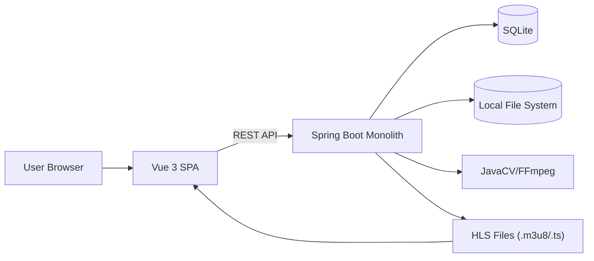
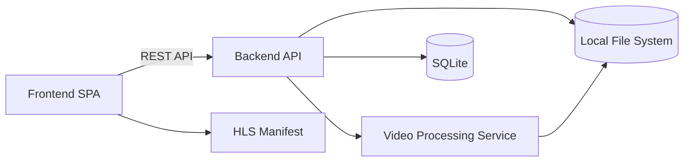
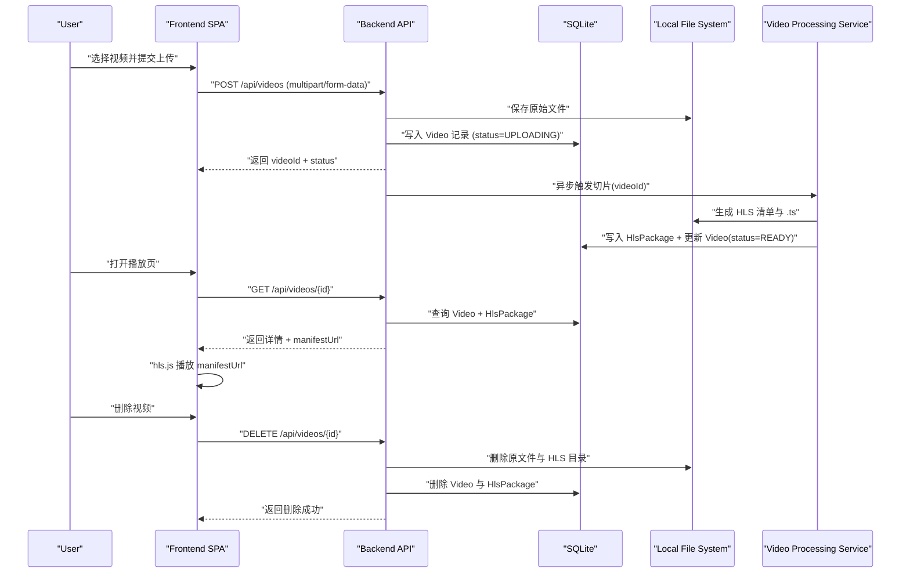
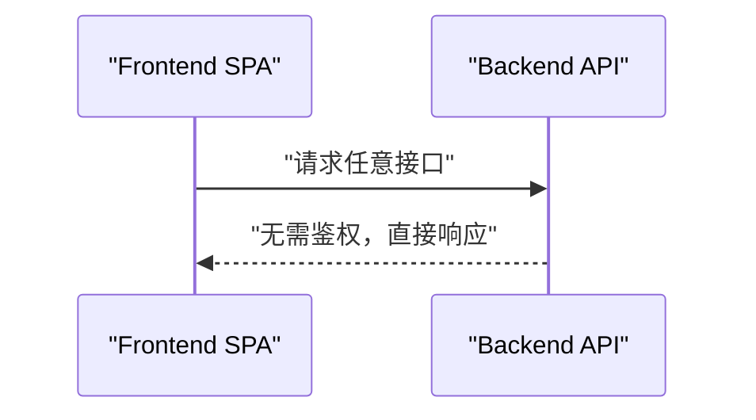
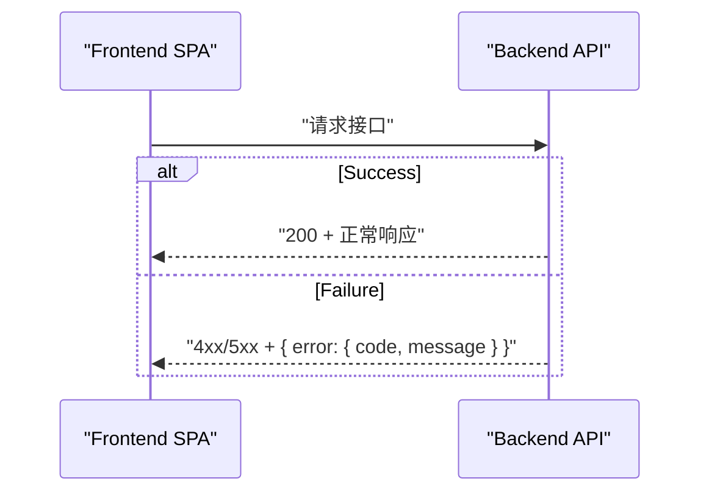

# 在线视频网站 Demo 全栈架构文档

## Introduction

本文档描述“在线视频网站 Demo”的完整全栈架构，覆盖后端系统、前端实现与二者的集成方式。它作为 AI 驱动开发的单一事实来源，确保技术栈与实现模式在全项目范围一致。

该统一架构将传统上分离的前端与后端架构合并，适用于本项目这种前后端紧密协作的全栈应用场景。

> 备注：未发现 `docs/front-end-spec.md`，当前内容基于 `docs/prd.md` 草拟，待补充前端规格后再校准。

### Starter Template or Existing Project

N/A - Greenfield project。PRD 未提及现有代码库或可复用模板。建议采用以下起步模板：

- 后端：Spring Initializr（Spring Boot + Maven + Java 21）
- 前端：Vite `create-vue`（Vue 3）

根目录采用 `backend/` 与 `frontend/` 分离结构，与 PRD 的 Monorepo（前后端分目录）一致。

### Change Log

| Date       | Version | Description      | Author  |
| ---------- | ------- | ---------------- | ------- |
| 2026-01-14 | v0.1    | 初始全栈架构草案 | Winston |

## High Level Architecture

### Technical Summary

本项目采用本机离线可运行的单体架构：Vue 3 前端 SPA 通过 REST API 与 Spring Boot 后端集成。后端负责上传、元数据管理与 HLS 分片处理，并通过同一服务提供 HLS 清单与分片的访问。数据与视频资源落地在本地文件系统与 SQLite，避免任何第三方依赖。异步处理使用应用内线程池/@Async 触发 JavaCV/FFmpeg 切片流程。该架构直接满足 PRD 的“本地可运行、无外部服务、端到端演示”目标。

### Platform and Infrastructure Choice

**可选方案（供确认）：**

1. **本机本地部署（推荐）**：全部服务运行在本机进程中，本地文件系统 + SQLite。
2. **本机 + Docker（可选）**：便于环境复现，但与“仅演示、不考虑发布”目标略有偏离。
3. **云平台部署（不推荐）**：与离线、无外部服务的目标冲突。

**Platform:** Local host (offline)  
**Key Services:** Spring Boot 单体服务、本地文件系统存储、SQLite、JavaCV/FFmpeg  
**Deployment Host and Regions:** 本机 / N/A

### Repository Structure

**Structure:** Monorepo（前后端分目录）  
**Monorepo Tool:** 无（使用原生目录结构）  
**Package Organization:** `backend/`（Spring Boot）与 `frontend/`（Vue 3）并列，可选 `docs/` 与 `data/` 目录；不引入共享包，必要时通过 API 契约与类型文档同步。

### High Level Architecture Diagram



### Architectural Patterns

- **Monolithic Backend:** 单体 Spring Boot 服务整合 API 与静态资源 - _Rationale:_ 规模小、离线运行、部署简单，匹配演示目标。
- **REST API + JSON:** 前后端以 REST 交互 - _Rationale:_ Vue 3 集成简单、便于调试与演示。
- **Component-Based UI:** Vue 组件化页面 - _Rationale:_ 三页结构清晰、复用成本低。
- **Repository Pattern (JPA):** 数据访问抽象 - _Rationale:_ 提升可测试性与可维护性。
- **Async Job Pattern:** 上传后异步切片 - _Rationale:_ 避免阻塞上传请求，符合“上传 → 处理 → 可播”的流程。

## Tech Stack

### 关键选型与推荐（请确认）

1. **Frontend Language**

   - 选项 A：TypeScript 5.4.x（推荐）  
     优点：类型安全、API 契约更清晰、AI 开发更稳。  
     代价：需要类型声明与编译步骤。
   - 选项 B：JavaScript (ES2022)  
     优点：上手更快、样板更少。  
     代价：类型缺失，长期维护风险较高。
   - **推荐：TypeScript 5.4.x**

2. **Frontend Framework**

   - 选项 A：Vue 3（PRD 约束，推荐）
   - 选项 B：React/Svelte（与 PRD 冲突，不建议）
   - **推荐：Vue 3**

3. **Backend Framework**

   - 选项 A：Spring Boot 3.2.x（PRD 约束，推荐）
   - 选项 B：Micronaut/Quarkus（与 PRD 冲突，不建议）
   - **推荐：Spring Boot 3.2.x**

4. **Database**

   - 选项 A：SQLite 3.4x（PRD 约束，推荐）
   - 选项 B：PostgreSQL/MySQL（与 PRD 冲突，不建议）
   - **推荐：SQLite**

5. **API Style**

   - 选项 A：REST + JSON（推荐）  
     优点：简单直观，便于前后端分工与调试。
   - 选项 B：GraphQL  
     优点：灵活查询；代价：复杂度与依赖增加。
   - **推荐：REST**

6. **Video Processing**

   - 选项 A：JavaCV 1.5.x + FFmpeg（PRD 约束，推荐）
   - 选项 B：直接调用 FFmpeg CLI（需额外封装，不符合 PRD）
   - **推荐：JavaCV**

7. **Testing**
   - 选项 A：按 PRD（Unit + Integration + 手工冒烟）
   - 选项 B：加入自动化 E2E（Playwright 等）
   - **推荐：先按 PRD 约束，不引入额外 E2E 工具**

### Technology Stack Table

| Category             | Technology                                   | Version        | Purpose         | Rationale                             |
| -------------------- | -------------------------------------------- | -------------- | --------------- | ------------------------------------- |
| Frontend Language    | TypeScript                                   | 5.4.2          | 前端开发语言    | 类型安全、利于 AI 开发与 API 契约对齐 |
| Frontend Framework   | Vue 3                                        | 3.4.15         | 前端 UI 框架    | PRD 指定，生态成熟                    |
| UI Component Library | None                                         | -              | UI 组件库       | 演示项目保持轻量，避免引入额外依赖    |
| State Management     | Pinia                                        | 2.1.7          | 简单全局状态    | Vue 官方推荐、轻量                    |
| Backend Language     | Java (OpenJDK)                               | 21.0.2         | 后端开发语言    | PRD 指定、LTS                         |
| Backend Framework    | Spring Boot                                  | 3.2.2          | 后端框架        | PRD 指定，生态完善                    |
| ORM                  | Spring Data JPA (JPA)                        | 3.2.2          | ORM 持久化层    | 明确使用 JPA，配套 Spring Boot        |
| ORM Dialect          | hibernate-community-dialects (SQLiteDialect) | 6.4.2.Final    | SQLite 方言支持 | 避免 JPA/SQLite 方言不兼容            |
| Database Driver      | sqlite-jdbc                                  | 3.45.2.0       | SQLite 驱动     | 确保 JDBC 连接稳定                    |
| API Style            | REST + JSON                                  | -              | 前后端通信      | 简单易调试，满足需求                  |
| Database             | SQLite                                       | 3.45.1         | 元数据存储      | PRD 指定、本地离线                    |
| Cache                | None                                         | -              | 缓存            | 规模小，无必要                        |
| File Storage         | Local File System                            | -              | 视频与 HLS 产物 | PRD 指定、本地离线                    |
| Authentication       | None                                         | -              | 鉴权            | PRD 指定无需登录                      |
| Frontend Testing     | Vitest + Vue Test Utils                      | 1.2.2 / 2.4.3  | 单元测试        | 与 Vite/Vue 生态匹配                  |
| Backend Testing      | JUnit 5 + Spring Boot Test                   | 5.10.1 / 3.2.2 | 单元与集成测试  | 与 Spring Boot 原生集成               |
| E2E Testing          | Manual Smoke                                 | -              | 端到端验证      | PRD 指定手工冒烟                      |
| Build Tool           | Maven / Vite                                 | 3.9.6 / 5.1.4  | 构建与开发      | 后端与前端分别最佳实践                |
| Bundler              | Vite (Rollup)                                | 5.1.4          | 前端打包        | 默认集成、性能好                      |
| IaC Tool             | None                                         | -              | 基础设施        | 本地演示无需 IaC                      |
| CI/CD                | None                                         | -              | 自动化流水线    | 演示项目不要求                        |
| Monitoring           | None                                         | -              | 监控            | 演示项目不要求                        |
| Logging              | Logback (Spring Boot)                        | 1.4.14         | 应用日志        | Spring Boot 默认                      |
| CSS Framework        | None                                         | -              | 样式方案        | 保持简洁，中性风格                    |

## Data Models

### Video

**Purpose:** 表示上传视频的元数据与处理状态，用于列表展示、播放与删除。

**Key Attributes:**

- id: number - 视频唯一标识（自增）
- title: string - 用户输入标题
- originalFilename: string - 原始文件名
- sizeBytes: number - 文件大小
- status: "UPLOADING" | "READY" | "FAILED" - 处理状态
- errorCode: string? - 失败错误码（可空）
- errorMessage: string? - 失败错误信息（可空）
- storagePath: string - 原始文件存储路径
- createdAt: number - 创建时间（Unix ms）
- updatedAt: number - 状态更新时间（Unix ms）

#### TypeScript Interface

```typescript
export interface Video {
  id: number;
  title: string;
  originalFilename: string;
  sizeBytes: number;
  status: "UPLOADING" | "READY" | "FAILED";
  errorCode?: string;
  errorMessage?: string;
  storagePath: string;
  createdAt: number;
  updatedAt: number;
}
```

#### Relationships

- Video 通过 `videoId` 与 HlsPackage 建立 1:1 关联（仅当切片完成时存在）。
- 列表与详情接口以 Video 为主实体，按需聚合 HlsPackage 生成播放地址。
- 详情接口返回 `manifestUrl`（由 `manifestPath` 映射生成）。

### HlsPackage

**Purpose:** 管理逻辑视频与 HLS 切片产物的关系，记录清单与切片目录信息。

**Key Attributes:**

- videoId: number - 关联 Video.id（主键/外键）
- manifestPath: string - HLS 清单相对路径（如 `data/videos/{id}/hls/index.m3u8`）
- segmentDir: string - 切片目录（如 `data/videos/{id}/hls/`）
- segmentPattern: string - 切片文件命名模式（如 `seg_%05d.ts`）
- segmentDurationSeconds: number - 切片时长（固定 2）
- segmentCount: number - 切片数量
- totalDurationSeconds: number - 总时长（可选）
- generatedAt: number - 切片完成时间（Unix ms）

#### TypeScript Interface

```typescript
export interface HlsPackage {
  videoId: number;
  manifestPath: string;
  segmentDir: string;
  segmentPattern: string;
  segmentDurationSeconds: number;
  segmentCount: number;
  totalDurationSeconds?: number;
  generatedAt: number;
}
```

#### Relationships

- HlsPackage 属于 Video（1:1），切片文件列表以 `.m3u8` 清单为准，不在数据库中逐条存储。

## API Specification

### REST API Specification

```yaml
openapi: 3.0.0
info:
  title: video-demo-api
  version: "1.0.0"
  description: Local demo API for video upload, processing, playback, and deletion
servers:
  - url: http://localhost:8080
    description: Local Spring Boot server
```

**Endpoints 概览：**

- `POST /api/videos` 上传视频（multipart/form-data）
- `GET /api/videos` 获取视频列表
- `GET /api/videos/{id}` 获取视频详情（含 HLS 清单地址）
- `DELETE /api/videos/{id}` 删除视频及其产物
- `GET /media/{id}/index.m3u8` 获取 HLS 清单（静态资源或专用接口）

### DTO Definitions

```json
// VideoListItem
{
  "id": 1,
  "title": "示例视频",
  "status": "READY",
  "sizeBytes": 123456789,
  "createdAt": 1736840000000
}
```

```json
// VideoDetail
{
  "id": 1,
  "title": "示例视频",
  "status": "READY",
  "sizeBytes": 123456789,
  "createdAt": 1736840000000,
  "manifestUrl": "http://localhost:8080/media/1/index.m3u8"
}
```

```json
// ApiError
{
  "error": {
    "code": "VIDEO_NOT_FOUND",
    "message": "视频不存在",
    "timestamp": "2026-01-14T12:00:00Z",
    "requestId": "req-abc-123"
  }
}
```

### Endpoint Details

**POST /api/videos**  
上传视频（multipart/form-data）

Request (form-data):

- `file`: MP4 (H.264)
- `title`: string

Response 201:

```json
{
  "id": 1,
  "title": "示例视频",
  "status": "UPLOADING",
  "sizeBytes": 123456789,
  "createdAt": 1736840000000
}
```

Errors:

- 400 `INVALID_REQUEST`
- 400 `INVALID_MEDIA_TYPE`
- 413 `UPLOAD_TOO_LARGE`
- 500 `STORAGE_IO_ERROR`

**GET /api/videos**  
获取视频列表

Response 200:

```json
[
  {
    "id": 1,
    "title": "示例视频",
    "status": "READY",
    "sizeBytes": 123456789,
    "createdAt": 1736840000000
  }
]
```

**GET /api/videos/{id}**  
获取视频详情

Response 200:

```json
{
  "id": 1,
  "title": "示例视频",
  "status": "READY",
  "sizeBytes": 123456789,
  "createdAt": 1736840000000,
  "manifestUrl": "http://localhost:8080/media/1/index.m3u8"
}
```

Errors:

- 404 `VIDEO_NOT_FOUND`
- 409 `HLS_NOT_READY`

**DELETE /api/videos/{id}**  
删除视频

Response 204: no content

Errors:

- 404 `VIDEO_NOT_FOUND`
- 500 `STORAGE_IO_ERROR`

### Media URL Mapping

- `manifestUrl` 统一规则：`http://localhost:8080/media/{videoId}/index.m3u8`
- 文件落盘规则：`${APP_STORAGE_ROOT}/{videoId}/hls/index.m3u8`
  **选定方案：** 使用 Spring `ResourceHandler` 将 `/media/**` 映射到 `${APP_STORAGE_ROOT}/`（演示项目优先简化实现）。

```java
// WebMvcConfigurer (简化示例)
registry.addResourceHandler("/media/**")
        .addResourceLocations("file:" + appStorageRoot + "/");
```

## Components

### Backend API (Spring Boot)

**Responsibility:** 提供上传、列表、详情、删除等 REST API，并管理 HLS 静态资源访问。  
**Key Interfaces:**

- `POST /api/videos`
- `GET /api/videos`
- `GET /api/videos/{id}`
- `DELETE /api/videos/{id}`
  **Dependencies:** SQLite、Local File System、JavaCV/FFmpeg  
  **Technology Stack:** Spring Boot 3.2.x + Spring Data JPA + Java 21

### Video Processing Service

**Responsibility:** 异步执行视频切片，生成 HLS 清单与 `.ts` 文件，更新处理状态。  
**Key Interfaces:**

- `process(videoId)` 内部服务调用
- 处理完成后更新 `Video` 与 `HlsPackage`
  **Dependencies:** JavaCV/FFmpeg、本地文件系统  
  **Technology Stack:** JavaCV 1.5.x + Spring `@Async`/线程池

**Failure Handling & Idempotency:**

- 处理开始前清理旧的 HLS 目录（若存在）避免脏数据
- 处理失败时更新 `Video.status=FAILED`，写入 `error_code/error_message`
- 失败时清理部分产物（HLS 目录），避免下次播放误读
- 不做自动重试，用户需重新上传

### Frontend SPA (Vue 3)

**Responsibility:** 列表展示、上传进度、播放与删除交互。  
**Key Interfaces:**

- 通过 API 调用后端
- 使用 HLS 清单地址播放
  **Dependencies:** Backend API、hls.js  
  **Technology Stack:** Vue 3 + Vite + Pinia + hls.js

### Component Diagrams



## Core Workflows



## Database Schema

```sql
CREATE TABLE `t_videos` (
  `id` BIGINT UNSIGNED PRIMARY KEY AUTOINCREMENT,
  `title` VARCHAR(255) NOT NULL,
  `original_filename` VARCHAR(255) NOT NULL,
  `size_bytes` INTEGER NOT NULL,
  `status` VARCHAR(16) NOT NULL CHECK (`status` IN ('UPLOADING','READY','FAILED')),
  `error_code` VARCHAR(64),
  `error_message` VARCHAR(512),
  `storage_path` VARCHAR(1024) NOT NULL,
  `created_at` BIGINT UNSIGNED NOT NULL,
  `updated_at` BIGINT UNSIGNED NOT NULL
);

CREATE TABLE `t_hls_packages` (
  `video_id` BIGINT UNSIGNED PRIMARY KEY,
  `manifest_path` VARCHAR(1024) NOT NULL,
  `segment_dir` VARCHAR(1024) NOT NULL,
  `segment_pattern` VARCHAR(64) NOT NULL,
  `segment_duration_seconds` BIGINT UNSIGNED NOT NULL,
  `segment_count` INTEGER NOT NULL,
  `total_duration_seconds` BIGINT UNSIGNED,
  `generated_at` BIGINT UNSIGNED NOT NULL,
  FOREIGN KEY (`video_id`) REFERENCES `t_videos`(`id`) ON DELETE CASCADE
);

CREATE INDEX `idx_t_videos_status` ON `t_videos` (`status`);
```

## Frontend Architecture

### Component Architecture

#### Component Organization

```text
frontend/
  src/
    pages/
      VideoListPage.vue
      UploadPage.vue
      PlayerPage.vue
    components/
      VideoListItem.vue
      UploadTaskItem.vue
      VideoPlayer.vue
      ConfirmDialog.vue
      EmptyPlaceholder.vue
    services/
      apiClient.ts
      videoService.ts
    stores/
      videoStore.ts
      uploadStore.ts
    router/
      index.ts
    types/
      video.ts
      api.ts
    styles/
      base.css
    main.ts
```

#### Component Template

```typescript
<script setup lang="ts">
import type { Video } from "../types/video";

interface Props {
  video: Video;
}

defineProps<Props>();
</script>

<template>
  <div class="video-item">
    <div class="title">{{ video.title }}</div>
    <div class="status">{{ video.status }}</div>
  </div>
</template>
```

### State Management Architecture

#### State Structure

```typescript
// stores/videoStore.ts
import { defineStore } from "pinia";
import type { Video } from "../types/video";
import { videoService } from "../services/videoService";

interface VideoState {
  items: Video[];
  selected?: Video;
  loading: boolean;
  error?: { code: string; message: string };
}

export const useVideoStore = defineStore("video", {
  state: (): VideoState => ({
    items: [],
    selected: undefined,
    loading: false,
    error: undefined,
  }),
  actions: {
    async fetchList() {
      this.loading = true;
      this.error = undefined;
      try {
        this.items = await videoService.list();
      } catch (err: any) {
        this.error = err?.error ?? { code: "UNKNOWN", message: "加载失败" };
      } finally {
        this.loading = false;
      }
    },
  },
});
```

#### State Management Patterns

- 列表与详情状态分离，避免互相污染
- 所有异步调用通过 store actions 统一管理
- UI 仅消费 store 状态，不直接调用 API

### UI 状态与文案

**列表页（/）**

- 空态：`暂无视频，去上传一个吧`
- 加载中：`加载中...`
- 错误态：`加载失败：{message}`

**上传页（/upload）**

- 默认提示：`选择 H.264 MP4 文件（≤ 5GB）`
- 上传中：`正在上传... {progress}%`
- 上传成功：`上传完成，处理中`
- 上传失败：`上传失败：{message}`

**播放页（/play/:id）**

- 未就绪占位：`视频处理中，暂不可播放`
- 播放失败：`播放失败：{message}`
- 删除确认：`确定删除该视频吗？删除后不可恢复`

### Routing Architecture

#### Route Organization

```text
/
/upload
/play/:id
```

#### Protected Route Pattern

```typescript
// router/index.ts
import { createRouter, createWebHistory } from "vue-router";

const routes = [
  { path: "/", component: () => import("../pages/VideoListPage.vue") },
  { path: "/upload", component: () => import("../pages/UploadPage.vue") },
  { path: "/play/:id", component: () => import("../pages/PlayerPage.vue") },
];

const router = createRouter({
  history: createWebHistory(),
  routes,
});

// 无鉴权需求，直接放行
router.beforeEach(() => true);

export default router;
```

### Frontend Services Layer

#### API Client Setup

```typescript
// services/apiClient.ts
const API_BASE = import.meta.env.VITE_API_BASE ?? "http://localhost:8080";

async function request<T>(path: string, init?: RequestInit): Promise<T> {
  const res = await fetch(`${API_BASE}${path}`, init);
  const data = await res.json();
  if (!res.ok) {
    throw { error: data?.error ?? { code: "UNKNOWN", message: "请求失败" } };
  }
  return data as T;
}

export const apiClient = { request };
```

**开发环境端口约束：**  
前端调试服务器端口需与后端端口不同，避免冲突与跨源问题。建议前端使用 `5173`（Vite 默认），后端使用 `8080`。

#### Service Example

```typescript
// services/videoService.ts
import { apiClient } from "./apiClient";
import type { Video } from "../types/video";

export const videoService = {
  list: () => apiClient.request<Video[]>("/api/videos"),
  detail: (id: number) => apiClient.request<Video>(`/api/videos/${id}`),
  delete: (id: number) =>
    apiClient.request<void>(`/api/videos/${id}`, { method: "DELETE" }),
  upload: (file: File, title: string) => {
    const form = new FormData();
    form.append("file", file);
    form.append("title", title);
    return apiClient.request<Video>("/api/videos", {
      method: "POST",
      body: form,
    });
  },
};
```

## Backend Architecture

### Service Architecture

#### Controller/Route Organization

```text
backend/
  src/main/java/com/example/videodemo/
    controller/
      VideoController.java
      MediaController.java
    service/
      VideoService.java
      ProcessingService.java
    repository/
      VideoRepository.java
      HlsPackageRepository.java
    entity/
      Video.java
      HlsPackage.java
    config/
      AsyncConfig.java
      StorageConfig.java
```

#### Controller Template

```java
// controller/VideoController.java (简化示例)
@RestController
@RequestMapping("/api/videos")
public class VideoController {

  @PostMapping
  public VideoDto upload(@RequestParam("file") MultipartFile file,
                         @RequestParam("title") String title) { ... }

  @GetMapping
  public List<VideoDto> list() { ... }

  @GetMapping("/{id}")
  public VideoDetailDto detail(@PathVariable long id) { ... }

  @DeleteMapping("/{id}")
  public void delete(@PathVariable long id) { ... }
}
```

### Database Architecture

#### Schema Design

数据库结构见 “Database Schema” 章节，`t_videos` 与 `t_hls_packages` 为 1:1 关系，`video_id` 外键级联删除。

#### SQLite Compatibility

```yaml
# application.yml
spring:
  jpa:
    database-platform: org.hibernate.community.dialect.SQLiteDialect
    hibernate:
      ddl-auto: update
  datasource:
    url: jdbc:sqlite:${APP_DB_PATH}
    driver-class-name: org.sqlite.JDBC
```

#### Data Access Layer

```java
// repository/VideoRepository.java
public interface VideoRepository extends JpaRepository<Video, Long> {}
```

### Authentication and Authorization

#### Auth Flow



#### Middleware/Guards

```text
无鉴权需求，保持默认 Spring Boot 安全配置放行。
```

## Unified Project Structure

```text
project-root/
  backend/
    src/main/java/com/example/videodemo/
    src/main/resources/
    pom.xml
  frontend/
    src/
    index.html
    vite.config.ts
    package.json
  data/
    videos/
    app.db
  docs/
    prd.md
    architecture.md
  startup.sh
  README.md
```

## Development Workflow

### Local Development Setup

#### Prerequisites

```bash
# Java 21
java -version

# Node.js (LTS)
node -v
npm -v
```

#### Initial Setup

```bash
# Backend
cd backend
mvn -v

# Frontend
cd ../frontend
npm install
```

#### Development Commands

```bash
# Start all services (root)
./startup.sh

# Start frontend only
cd frontend
npm run dev -- --port 5173

# Start backend only
cd backend
mvn spring-boot:run

# Run tests
cd backend
mvn test
cd ../frontend
npm run test
```

### Environment Configuration

#### Required Environment Variables

```bash
# Frontend (.env.local)
VITE_API_BASE=http://localhost:8080

# Backend (.env)
APP_STORAGE_ROOT=./data/videos
APP_DB_PATH=./data/app.db
APP_HLS_SEGMENT_SECONDS=2
APP_UPLOAD_MAX_BYTES=5368709120
SPRING_SERVLET_MULTIPART_MAX_FILE_SIZE=5GB
SPRING_SERVLET_MULTIPART_MAX_REQUEST_SIZE=5GB
SPRING_SERVLET_MULTIPART_FILE_SIZE_THRESHOLD=1MB
SPRING_SERVLET_MULTIPART_LOCATION=./data/tmp
SERVER_TOMCAT_MAX_SWALLOW_SIZE=5GB
SERVER_TOMCAT_CONNECTION_TIMEOUT=600000
SERVER_TOMCAT_KEEP_ALIVE_TIMEOUT=600000

# Shared
# (none)
```

## Local Validation

### JPA + SQLite

- 启动后端，确认 `data/app.db` 生成且 `t_videos`、`t_hls_packages` 已创建
- 通过上传接口创建记录，验证 `t_videos` 可读写
- 删除视频后确认 `t_hls_packages` 级联删除生效

### 5GB 上传与临时目录

- 准备接近 5GB 的 H.264 MP4 文件，验证上传不被拒绝
- 上传过程中检查 `data/tmp` 是否产生临时文件
- 上传完成后确认临时文件被清理或可手动清理

### HLS 访问映射

- 处理完成后，确认 `manifestUrl` 返回且可直接访问
- 使用浏览器访问 `http://localhost:8080/media/{videoId}/index.m3u8` 验证可读

## Deployment Architecture

### Deployment Strategy

**Frontend Deployment:**

- **Platform:** Local host
- **Build Command:** `npm run build`
- **Output Directory:** `dist`
- **CDN/Edge:** N/A

**Backend Deployment:**

- **Platform:** Local host
- **Build Command:** `mvn package`
- **Deployment Method:** `java -jar target/*.jar`

### CI/CD Pipeline

```yaml
# 演示项目不要求 CI/CD
```

### Environments

| Environment | Frontend URL          | Backend URL           | Purpose           |
| ----------- | --------------------- | --------------------- | ----------------- |
| Development | http://localhost:5173 | http://localhost:8080 | Local development |
| Staging     | N/A                   | N/A                   | Not used          |
| Production  | N/A                   | N/A                   | Not used          |

## Security and Performance

### Security Requirements

**Frontend Security:**

- CSP Headers: 本地演示不强制，但建议开启基础 CSP
- XSS Prevention: 模板输出默认转义；禁止 `v-html` 直插用户输入
- Secure Storage: 不存储敏感信息

**Backend Security:**

- Input Validation: 上传文件类型与大小校验
- Rate Limiting: 演示环境不启用
- CORS Policy: 允许 `http://localhost:5173` 访问 `http://localhost:8080`

**Authentication Security:**

- Token Storage: N/A
- Session Management: N/A
- Password Policy: N/A

### Performance Optimization

**Frontend Performance:**

- Bundle Size Target: 小于 500KB（gzip，演示级）
- Loading Strategy: 路由按需加载
- Caching Strategy: 浏览器默认缓存即可

**Backend Performance:**

- Response Time Target: 列表/详情 < 500ms（本机）
- Database Optimization: 基于 `status` 索引
- Caching Strategy: 不使用缓存

## Testing Strategy

### Testing Pyramid

```text
E2E Tests
/        \
Integration Tests
/            \
Frontend Unit  Backend Unit
```

### Test Organization

**Frontend Tests**

```
frontend/
  tests/
    components/
    pages/
```

**Backend Tests**

```
backend/
  src/test/java/com/example/videodemo/
    controller/
    service/
    repository/
```

**E2E Tests**

```
N/A (手工冒烟)
```

### Test Examples

**Frontend Component Test**

```typescript
// VideoListItem.spec.ts
import { mount } from "@vue/test-utils";
import VideoListItem from "@/components/VideoListItem.vue";

test("renders title", () => {
  const wrapper = mount(VideoListItem, {
    props: { video: { id: 1, title: "demo", status: "READY" } },
  });
  expect(wrapper.text()).toContain("demo");
});
```

**Backend API Test**

```java
@SpringBootTest
@AutoConfigureMockMvc
class VideoControllerTest {
  @Autowired MockMvc mvc;

  @Test
  void listShouldReturnOk() throws Exception {
    mvc.perform(get("/api/videos"))
       .andExpect(status().isOk());
  }
}
```

**E2E Test**

```
N/A (手工冒烟)
```

## Coding Standards

### Critical Fullstack Rules

- **Type Sharing:** 前后端共享类型以 `frontend/src/types` 为准，后端 DTO 与之保持字段一致
- **Error Format:** 所有失败响应必须返回 `{ error: { code, message } }`
- **Async Processing:** 上传接口只负责入库与落盘，切片必须异步处理
- **Storage Paths:** 存储路径全部通过配置读取，不允许硬编码

### Naming Conventions

| Element         | Frontend   | Backend    | Example             |
| --------------- | ---------- | ---------- | ------------------- |
| Components      | PascalCase | -          | `VideoListPage.vue` |
| API Routes      | -          | kebab-case | `/api/videos`       |
| Database Tables | -          | snake_case | `t_videos`          |

## Error Handling Strategy

### Error Flow



### Error Response Format

```typescript
interface ApiError {
  error: {
    code: string;
    message: string;
    details?: Record<string, any>;
    timestamp: string;
    requestId: string;
  };
}
```

### Error Code Catalog

| Code               | HTTP | 场景             |
| ------------------ | ---- | ---------------- |
| VIDEO_NOT_FOUND    | 404  | 视频不存在       |
| INVALID_REQUEST    | 400  | 参数缺失或非法   |
| UPLOAD_TOO_LARGE   | 413  | 超过 5GB 限制    |
| INVALID_MEDIA_TYPE | 400  | 非 H.264 MP4     |
| PROCESSING_FAILED  | 500  | 切片失败         |
| HLS_NOT_READY      | 409  | 视频未就绪       |
| STORAGE_IO_ERROR   | 500  | 文件系统读写失败 |
| DB_ERROR           | 500  | 数据库错误       |
| INTERNAL_ERROR     | 500  | 未分类服务器错误 |

### Frontend Error Handling

```typescript
// services/apiClient.ts (简化示例)
try {
  // request...
} catch (err: any) {
  const message = err?.error?.message ?? "请求失败";
  // toast(message) or inline error
}
```

### Backend Error Handling

```java
@RestControllerAdvice
public class ApiExceptionHandler {

  @ExceptionHandler(Exception.class)
  public ResponseEntity<ApiError> handle(Exception ex) {
    return ResponseEntity
      .status(HttpStatus.INTERNAL_SERVER_ERROR)
      .body(ApiError.of("INTERNAL_ERROR", ex.getMessage()));
  }
}
```

## Monitoring and Observability

### Monitoring Stack

- **Frontend Monitoring:** 无（演示项目不接入第三方）
- **Backend Monitoring:** 无（仅控制台日志）
- **Error Tracking:** 无
- **Performance Monitoring:** 无

### Key Metrics

**Frontend Metrics:**

- 页面加载时间
- API 请求失败率

**Backend Metrics:**

- 请求量（QPS）
- 5xx 错误率
- 视频切片耗时

## Checklist Results Report

### Executive Summary

- **整体就绪度：中-偏高**
- **关键风险：** JPA 与 SQLite 兼容性验证、5GB 上传在低磁盘/慢速网络下的稳定性、静态资源直出缺少状态校验
- **主要优势：** PRD 约束符合度高、全链路流程清晰、核心数据模型与组件边界明确、前端结构与服务层规范
- **项目类型：** 全栈（前端依据本文件 “Frontend Architecture” 章节）

### Section Analysis

| Section                               | Pass Rate | Notes                                           |
| ------------------------------------- | --------- | ----------------------------------------------- |
| 1. Requirements Alignment             | 80%       | 主要功能覆盖，NFR 中可靠性与恢复策略仍偏弱      |
| 2. Architecture Fundamentals          | 80%       | 组件/数据流清晰，有流程图与组件图               |
| 3. Tech Stack & Decisions             | 80%       | 版本明确，已补充 SQLite 方言与驱动              |
| 4. Frontend Design & Implementation   | 70%       | 结构/路由/状态清晰，缺少可访问性与 UI 规格      |
| 5. Resilience & Operational Readiness | 55%       | 仍缺少重试/降级与告警策略                       |
| 6. Security & Compliance              | 60%       | 上传校验与 CORS 说明有，数据加密/保留策略未覆盖 |
| 7. Implementation Guidance            | 80%       | 规范/测试/本地流程齐全                          |
| 8. Dependency & Integration           | 65%       | 依赖清晰，缺少版本更新与许可策略                |
| 9. AI Implementation Suitability      | 75%       | 结构明确，已补充错误码与路径规则                |
| 10. Accessibility                     | N/A       | PRD 标明 “Accessibility: None”                  |

### Risk Assessment

1. **JPA + SQLite 兼容性风险（中）**
   - 影响：ORM 方言与类型映射不稳定，DDL/查询可能失败
   - 缓解：已指定 SQLiteDialect 与驱动，仍需本地验证用例
2. **5GB 上传稳定性风险（中）**
   - 影响：低磁盘/慢速上传下可能超时或失败
   - 缓解：已补充 multipart 与超时配置，需验证磁盘与临时目录清理
3. **静态资源直出缺少状态校验（低）**
   - 影响：可直接访问未就绪清单
   - 缓解：前端仅在 READY 状态展示 `manifestUrl`

### Mitigations Applied

- 已补充 SQLite 方言与 JDBC 驱动配置，降低 JPA 兼容风险
- 已补充上传 5GB 的 multipart 参数与临时目录配置
- 已明确 `manifestUrl` 与 `/media/**` 静态映射规则
- 已补充错误码目录与 HTTP 映射
- 已补充切片失败的状态更新与产物清理策略
- 已选定 ResourceHandler 方案用于静态资源直出

### Recommendations

**Must-fix：**

- 完成 JPA + SQLite 本地验证用例
- 验证 5GB 上传与临时目录清理策略

**Should-fix：**

- 增加最小可行的可观测性（requestId、耗时日志）
- 补充 API 请求/响应 DTO 示例

**Nice-to-have：**

- 补充前端 UI 状态说明（空态/错误态文案）
- 追加性能基准与压力测试建议

### AI Implementation Readiness

- 需要更明确的 DTO/接口结构与错误码表，降低实现歧义
- 明确存储路径模板（如 `data/videos/{id}/hls/index.m3u8`）
- 给出 JPA/SQLite 兼容配置示例以避免 AI 走偏

### Frontend-Specific Assessment

- 前端目录结构、路由与服务层清晰
- 缺少可访问性与 UI 规格细节（按 PRD 可接受，但建议最小化补充）
- 前后端接口字段需在文档中提供对齐示例
