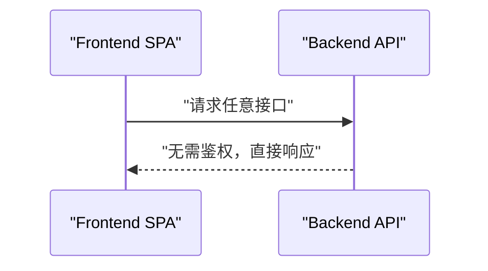

# Backend Architecture

## Service Architecture

### Controller/Route Organization

```text
backend/
  src/main/java/com/example/videodemo/
    controller/
      VideoController.java
      MediaController.java
    service/
      VideoService.java
      ProcessingService.java
    repository/
      VideoRepository.java
      HlsPackageRepository.java
    entity/
      Video.java
      HlsPackage.java
    config/
      AsyncConfig.java
      StorageConfig.java
```

### Controller Template

```java
// controller/VideoController.java (简化示例)
@RestController
@RequestMapping("/api/videos")
public class VideoController {

  @PostMapping
  public VideoDto upload(@RequestParam("file") MultipartFile file,
                         @RequestParam("title") String title) { ... }

  @GetMapping
  public List<VideoDto> list() { ... }

  @GetMapping("/{id}")
  public VideoDetailDto detail(@PathVariable long id) { ... }

  @DeleteMapping("/{id}")
  public void delete(@PathVariable long id) { ... }
}
```

## Database Architecture

### Schema Design

数据库结构见 “Database Schema” 章节，`t_videos` 与 `t_hls_packages` 为 1:1 关系，`video_id` 外键级联删除。

### SQLite Compatibility

```yaml
# application.yml
spring:
  jpa:
    database-platform: org.hibernate.community.dialect.SQLiteDialect
    hibernate:
      ddl-auto: update
  datasource:
    url: jdbc:sqlite:${APP_DB_PATH}
    driver-class-name: org.sqlite.JDBC
```

### Data Access Layer

```java
// repository/VideoRepository.java
public interface VideoRepository extends JpaRepository<Video, Long> {}
```

## Authentication and Authorization

### Auth Flow



### Middleware/Guards

```text
无鉴权需求，保持默认 Spring Boot 安全配置放行。
```
