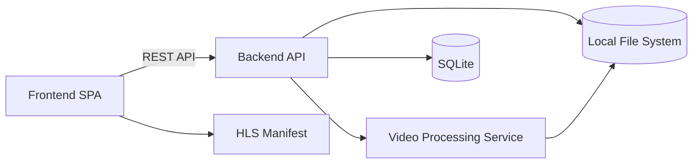

# Components

## Backend API (Spring Boot)

**Responsibility:** 提供上传、列表、详情、删除等 REST API，并管理 HLS 静态资源访问。  
**Key Interfaces:**

- `POST /api/videos`
- `GET /api/videos`
- `GET /api/videos/{id}`
- `DELETE /api/videos/{id}`
  **Dependencies:** SQLite、Local File System、JavaCV/FFmpeg  
  **Technology Stack:** Spring Boot 3.2.x + Spring Data JPA + Java 21

## Video Processing Service

**Responsibility:** 异步执行视频切片，生成 HLS 清单与 `.ts` 文件，更新处理状态。  
**Key Interfaces:**

- `process(videoId)` 内部服务调用
- 处理完成后更新 `Video` 与 `HlsPackage`
  **Dependencies:** JavaCV/FFmpeg、本地文件系统  
  **Technology Stack:** JavaCV 1.5.x + Spring `@Async`/线程池

**Failure Handling & Idempotency:**

- 处理开始前清理旧的 HLS 目录（若存在）避免脏数据
- 处理失败时更新 `Video.status=FAILED`，写入 `error_code/error_message`
- 失败时清理部分产物（HLS 目录），避免下次播放误读
- 不做自动重试，用户需重新上传

## Frontend SPA (Vue 3)

**Responsibility:** 列表展示、上传进度、播放与删除交互。  
**Key Interfaces:**

- 通过 API 调用后端
- 使用 HLS 清单地址播放
  **Dependencies:** Backend API、hls.js  
  **Technology Stack:** Vue 3 + Vite + Pinia + hls.js

## Component Diagrams

