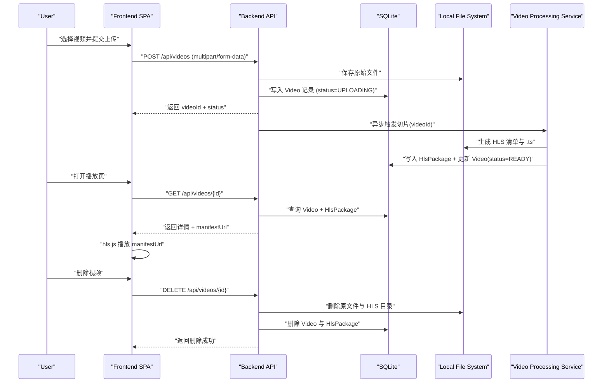

# Core Workflows

```mermaid
sequenceDiagram
  participant U as "User"
  participant FE as "Frontend SPA"
  participant BE as "Backend API"
  participant DB as "SQLite"
  participant FS as "Local File System"
  participant PROC as "Video Processing Service"

  U->>FE: "选择视频并提交上传"
  FE->>BE: "POST /api/videos (multipart/form-data)"
  BE->>FS: "保存原始文件"
  BE->>DB: "写入 Video 记录 (status=UPLOADING)"
  BE-->>FE: "返回 videoId + status"

  BE->>PROC: "异步触发切片(videoId)"
  PROC->>FS: "生成 HLS 清单与 .ts"
  PROC->>DB: "写入 HlsPackage + 更新 Video(status=READY)"

  U->>FE: "打开播放页"
  FE->>BE: "GET /api/videos/{id}"
  BE->>DB: "查询 Video + HlsPackage"
  BE-->>FE: "返回详情 + manifestUrl"
  FE->>FE: "hls.js 播放 manifestUrl"

  U->>FE: "删除视频"
  FE->>BE: "DELETE /api/videos/{id}"
  BE->>FS: "删除原文件与 HLS 目录"
  BE->>DB: "删除 Video 与 HlsPackage"
  BE-->>FE: "返回删除成功"
```
