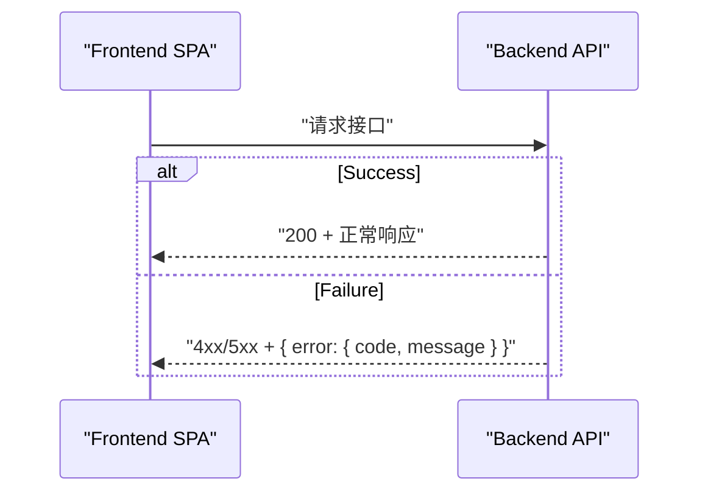

# Error Handling Strategy

## Error Flow



## Error Response Format

```typescript
interface ApiError {
  error: {
    code: string;
    message: string;
    details?: Record<string, any>;
    timestamp: string;
    requestId: string;
  };
}
```

## Error Code Catalog

| Code               | HTTP | 场景             |
| ------------------ | ---- | ---------------- |
| VIDEO_NOT_FOUND    | 404  | 视频不存在       |
| INVALID_REQUEST    | 400  | 参数缺失或非法   |
| UPLOAD_TOO_LARGE   | 413  | 超过 5GB 限制    |
| INVALID_MEDIA_TYPE | 400  | 非 H.264 MP4     |
| PROCESSING_FAILED  | 500  | 切片失败         |
| HLS_NOT_READY      | 409  | 视频未就绪       |
| STORAGE_IO_ERROR   | 500  | 文件系统读写失败 |
| DB_ERROR           | 500  | 数据库错误       |
| INTERNAL_ERROR     | 500  | 未分类服务器错误 |

## Frontend Error Handling

```typescript
// services/apiClient.ts (简化示例)
try {
  // request...
} catch (err: any) {
  const message = err?.error?.message ?? "请求失败";
  // toast(message) or inline error
}
```

## Backend Error Handling

```java
@RestControllerAdvice
public class ApiExceptionHandler {

  @ExceptionHandler(Exception.class)
  public ResponseEntity<ApiError> handle(Exception ex) {
    return ResponseEntity
      .status(HttpStatus.INTERNAL_SERVER_ERROR)
      .body(ApiError.of("INTERNAL_ERROR", ex.getMessage()));
  }
}
```
