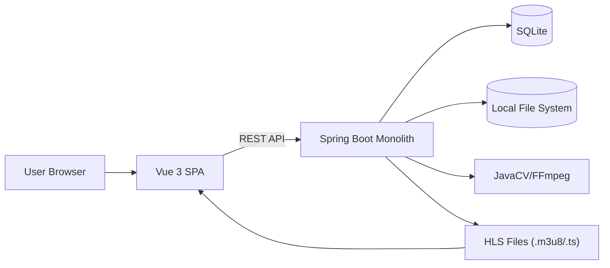

# High Level Architecture

## Technical Summary

本项目采用本机离线可运行的单体架构：Vue 3 前端 SPA 通过 REST API 与 Spring Boot 后端集成。后端负责上传、元数据管理与 HLS 分片处理，并通过同一服务提供 HLS 清单与分片的访问。数据与视频资源落地在本地文件系统与 SQLite，避免任何第三方依赖。异步处理使用应用内线程池/@Async 触发 JavaCV/FFmpeg 切片流程。该架构直接满足 PRD 的“本地可运行、无外部服务、端到端演示”目标。

## Platform and Infrastructure Choice

**可选方案（供确认）：**

1. **本机本地部署（推荐）**：全部服务运行在本机进程中，本地文件系统 + SQLite。
2. **本机 + Docker（可选）**：便于环境复现，但与“仅演示、不考虑发布”目标略有偏离。
3. **云平台部署（不推荐）**：与离线、无外部服务的目标冲突。

**Platform:** Local host (offline)  
**Key Services:** Spring Boot 单体服务、本地文件系统存储、SQLite、JavaCV/FFmpeg  
**Deployment Host and Regions:** 本机 / N/A

## Repository Structure

**Structure:** Monorepo（前后端分目录）  
**Monorepo Tool:** 无（使用原生目录结构）  
**Package Organization:** `backend/`（Spring Boot）与 `frontend/`（Vue 3）并列，可选 `docs/` 与 `data/` 目录；不引入共享包，必要时通过 API 契约与类型文档同步。

## High Level Architecture Diagram

## Architectural Patterns

- **Monolithic Backend:** 单体 Spring Boot 服务整合 API 与静态资源 - _Rationale:_ 规模小、离线运行、部署简单，匹配演示目标。
- **REST API + JSON:** 前后端以 REST 交互 - _Rationale:_ Vue 3 集成简单、便于调试与演示。
- **Component-Based UI:** Vue 组件化页面 - _Rationale:_ 三页结构清晰、复用成本低。
- **Repository Pattern (JPA):** 数据访问抽象 - _Rationale:_ 提升可测试性与可维护性。
- **Async Job Pattern:** 上传后异步切片 - _Rationale:_ 避免阻塞上传请求，符合“上传 → 处理 → 可播”的流程。
